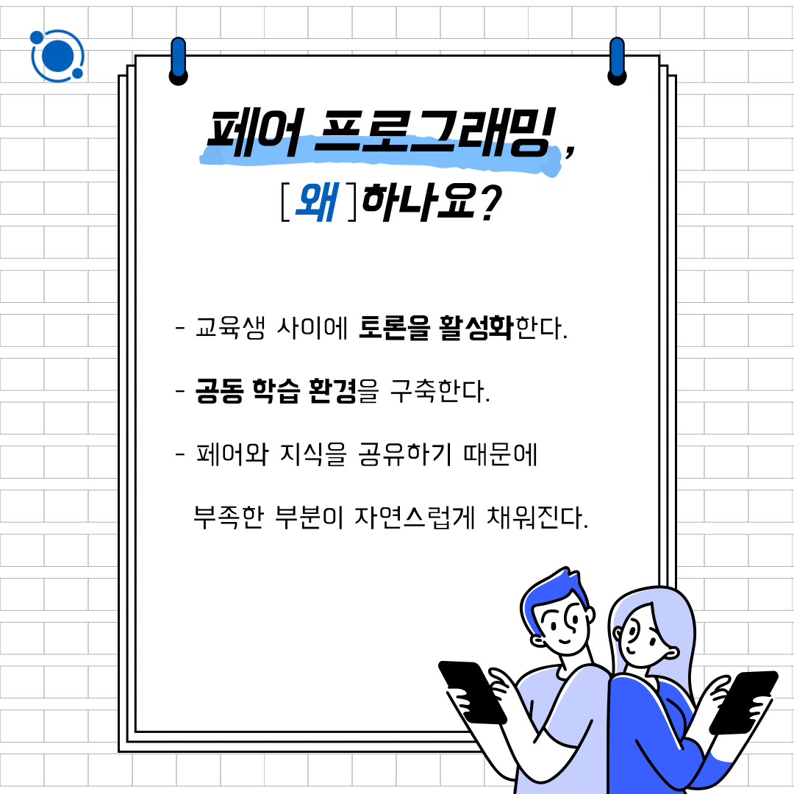
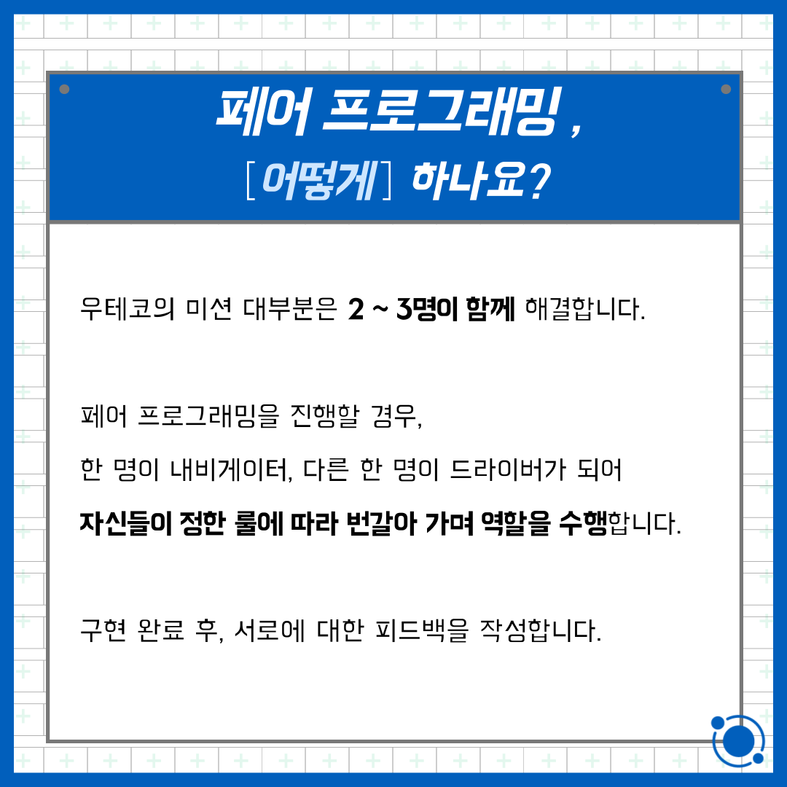
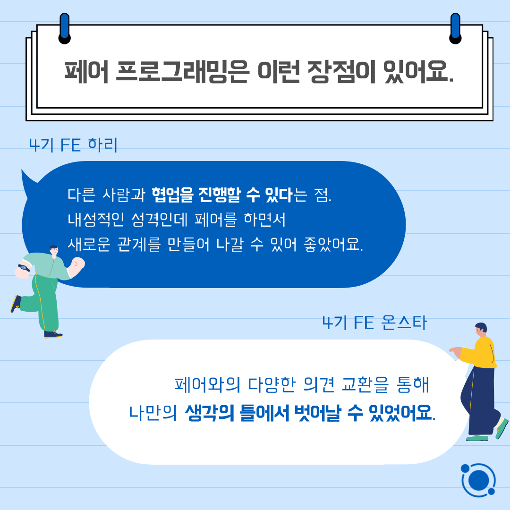
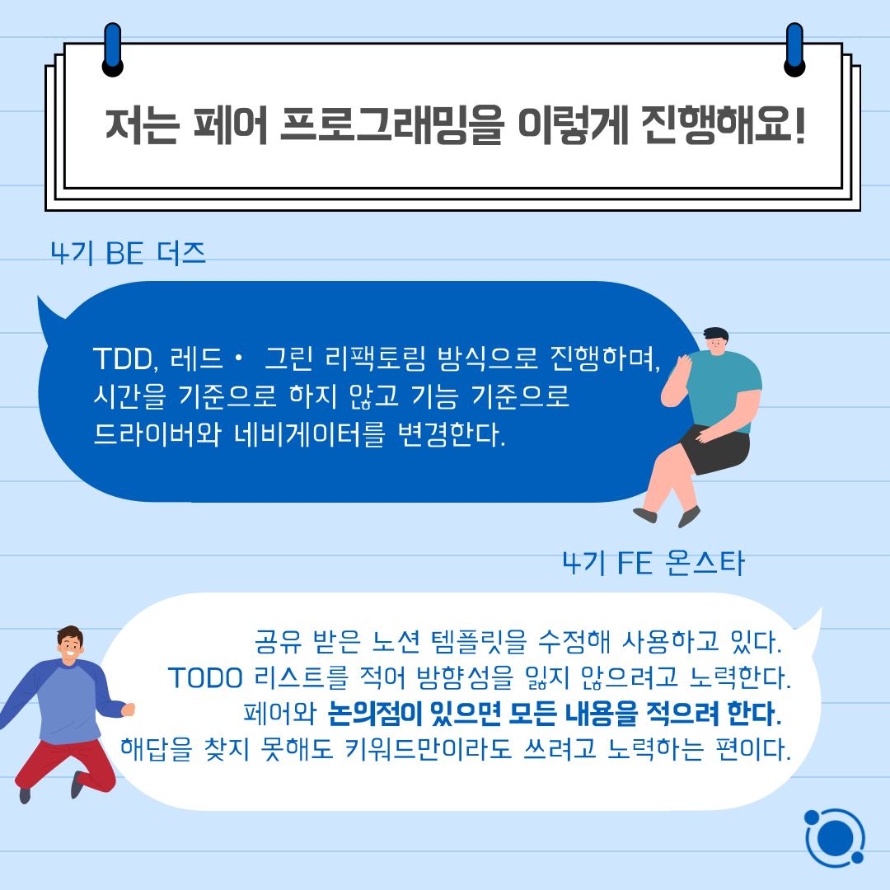

## 문화 / 페어 프로그래밍 소개 초안

#### 1. 표지 

#### 2. 페어 프로그래밍이란?

#### 3. 페어 프로그래밍, 왜 하나요?

#### 4. 페어 프로그래밍, 어떻게 하나요?

#### 5. 인터뷰 : 나에게 페어 프로그래밍이란 ~다.

#### 6. 인터뷰 : 페어 프로그래밍은 이런 장점이 있어요

#### 7. 인터뷰 : 혼자 프로그래밍 할 때와 이런 차이가 있어요.

#### 8. 인터뷰 : 이런점은 유의해야 해요.

#### 9. 인터뷰 : 나에게 인상 깊었던 페어 프로그래밍은?

#### 10. 인터뷰 : 저는 페어 프로그래밍을 이렇게 진행해요!

📮 6월 둘째주 <우아한테크코스 문화> 페어 프로그래밍

페어 프로그래밍에 대해 들어보셨나요 ❓

우아한테크코스는 페어 프로그래밍을 통해 '함께 자라기'를 지향합니다.

우아한테크코스의 문화, 페어 프로그래밍에 대해 소개합니다 🙂

우아한Tech 유튜브 : https://www.youtube.com/c/%EC%9A%B0%EC%95%84%ED%95%9CTech

우아한테크코스 홈페이지 : https://woowacourse.github.io

우테코 블로그(Tecoble) : https://tecoble.techcourse.co.kr

#우아한테크코스 #우테코 #잠실 #선릉 #부트캠프 #java #javascript #spring #react #개발문화 #개발 #개발자 #wooteco #techcourse #페어 #페어프로그래밍 #협업
