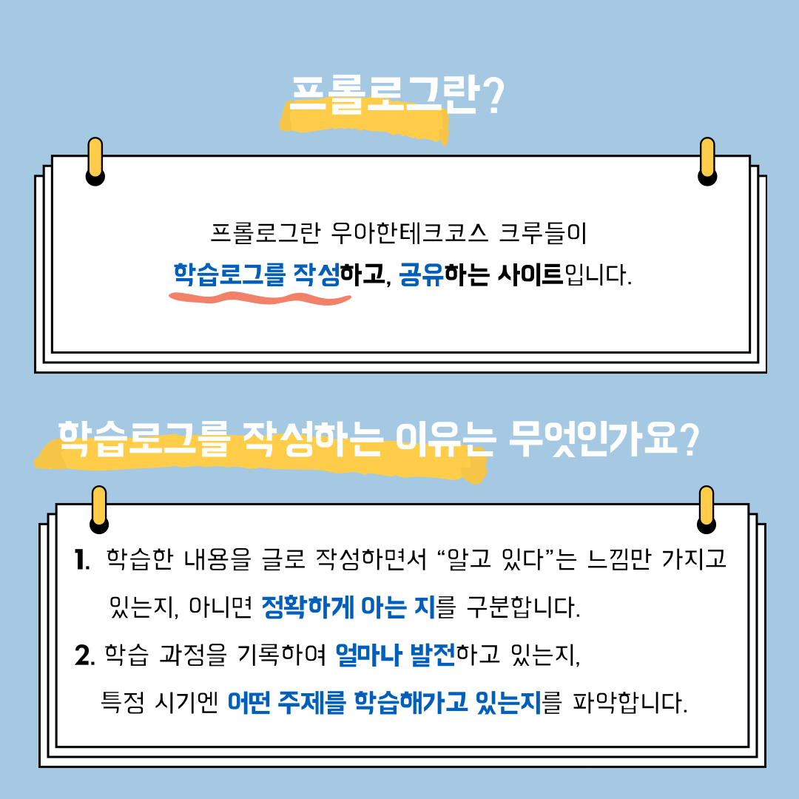
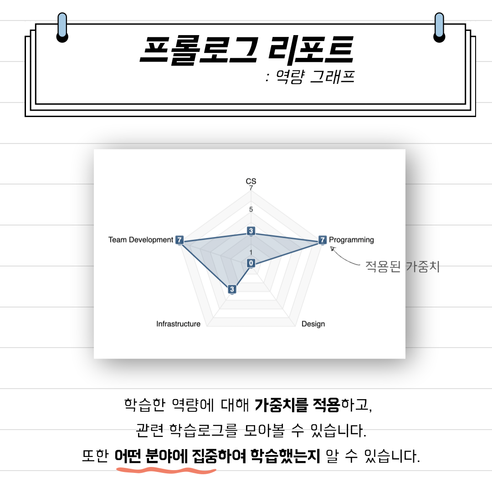

## 문화 - 프롤로그 소개

### 1번 - 표지

### 2번

### 3번

### 4번

### 5번

### 6번

### 7번

### 8번

### 9번

### 10번

 

📮 7월 넷째주 <우아한테크코스 문화> 프롤로그

우아한테크코스 크루들은 기록을 어떻게 할까 🤔❓  

우테코 크루들은 프롤로그를 통해 메타인지를 경험하고 있습니다 😆  

우아한테크코스의 문화, 프롤로그에 대해 소개합니다!   

우아한Tech 유튜브 : https://www.youtube.com/c/%EC%9A%B0%EC%95%84%ED%95%9CTech

우아한테크코스 홈페이지 : https://woowacourse.github.io

우테코 블로그(Tecoble) : https://tecoble.techcourse.co.kr

#우아한테크코스 #우테코 #잠실 #선릉 #부트캠프 #java #javascript #spring #react #개발문화 #개발 #개발자 #wooteco #techcourse #기록 #prolog #메타인지 #학습로그
