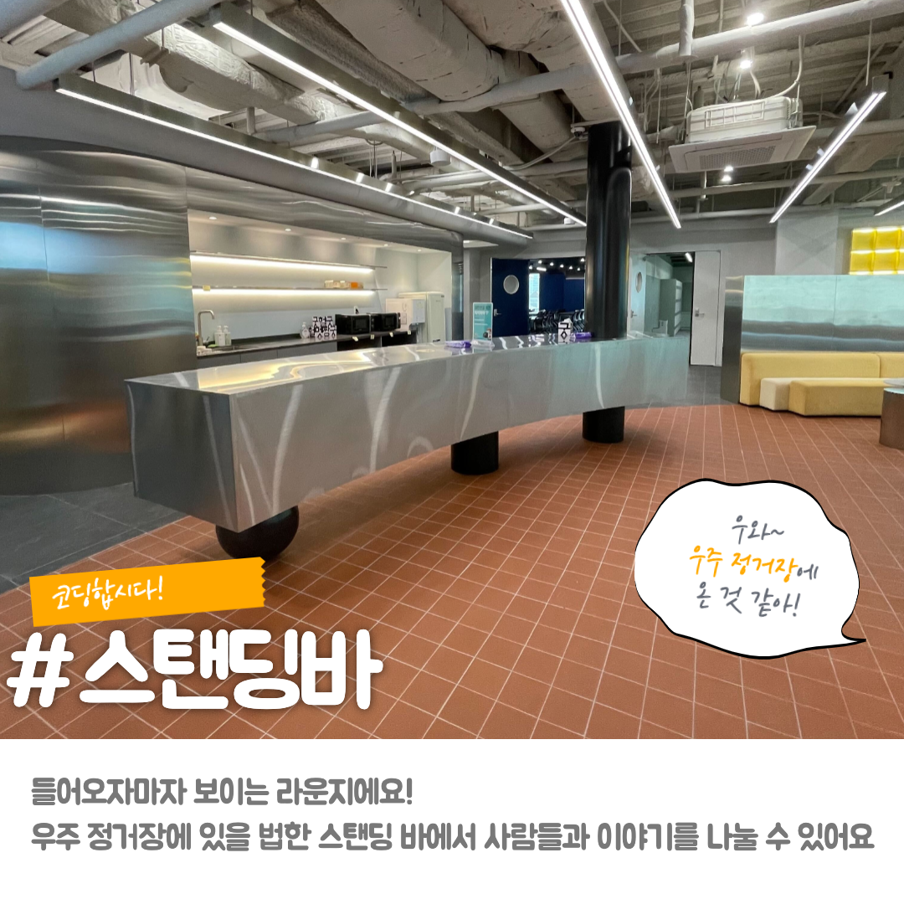
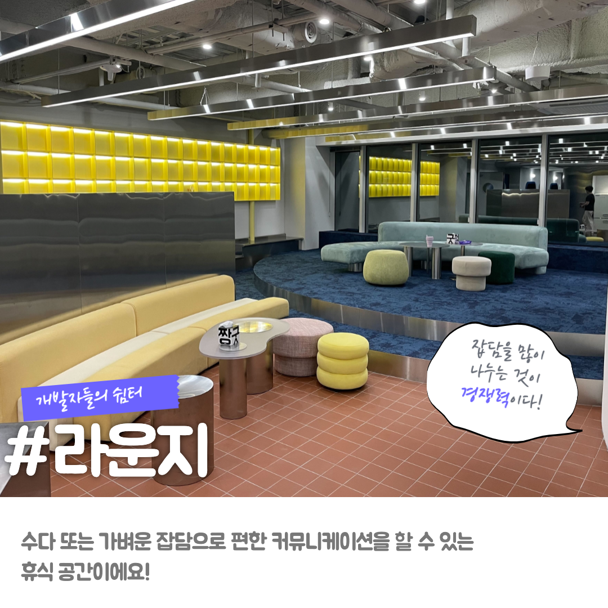
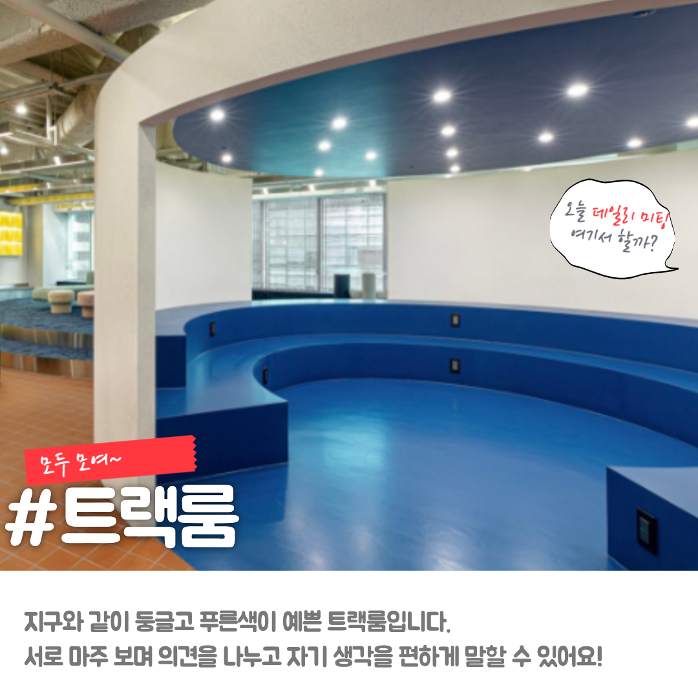
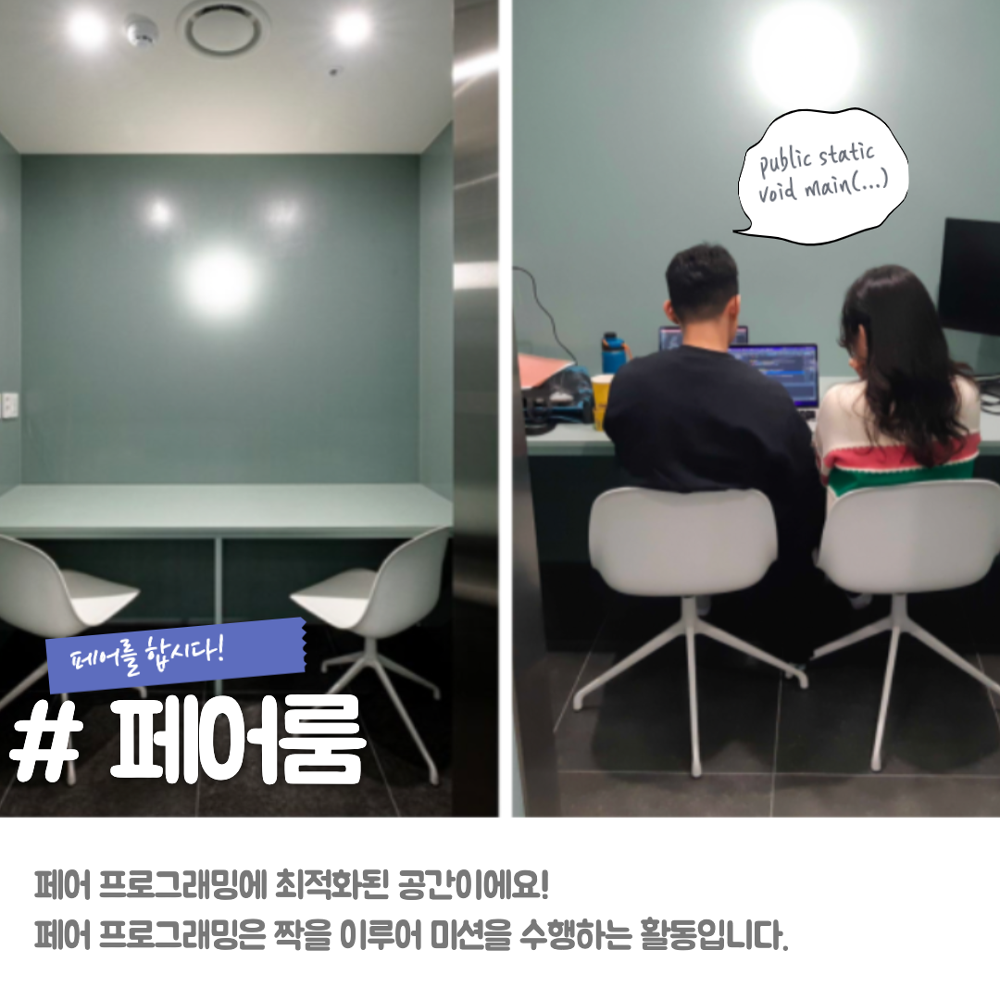
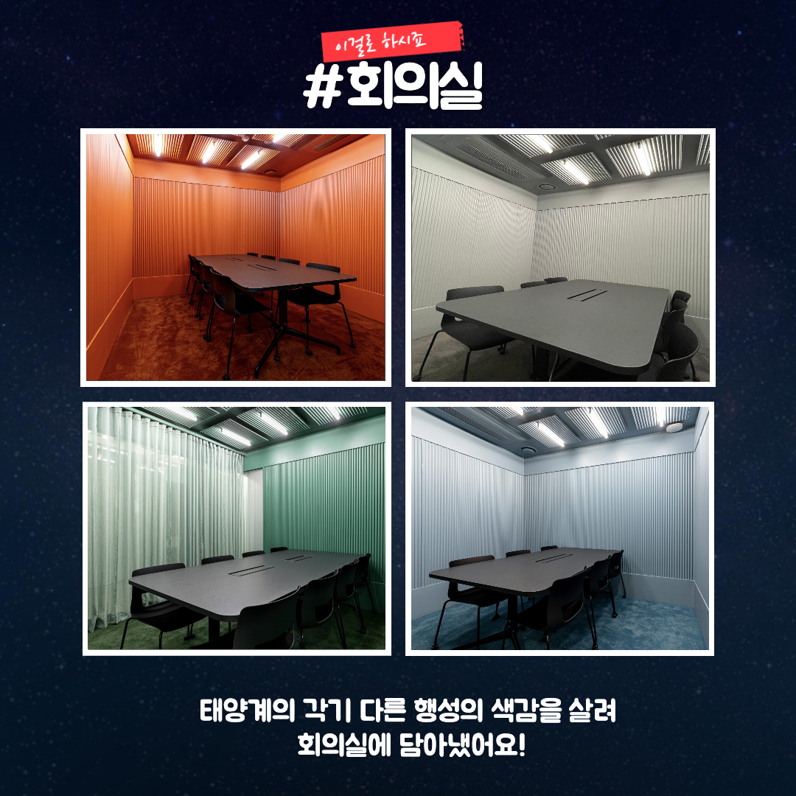
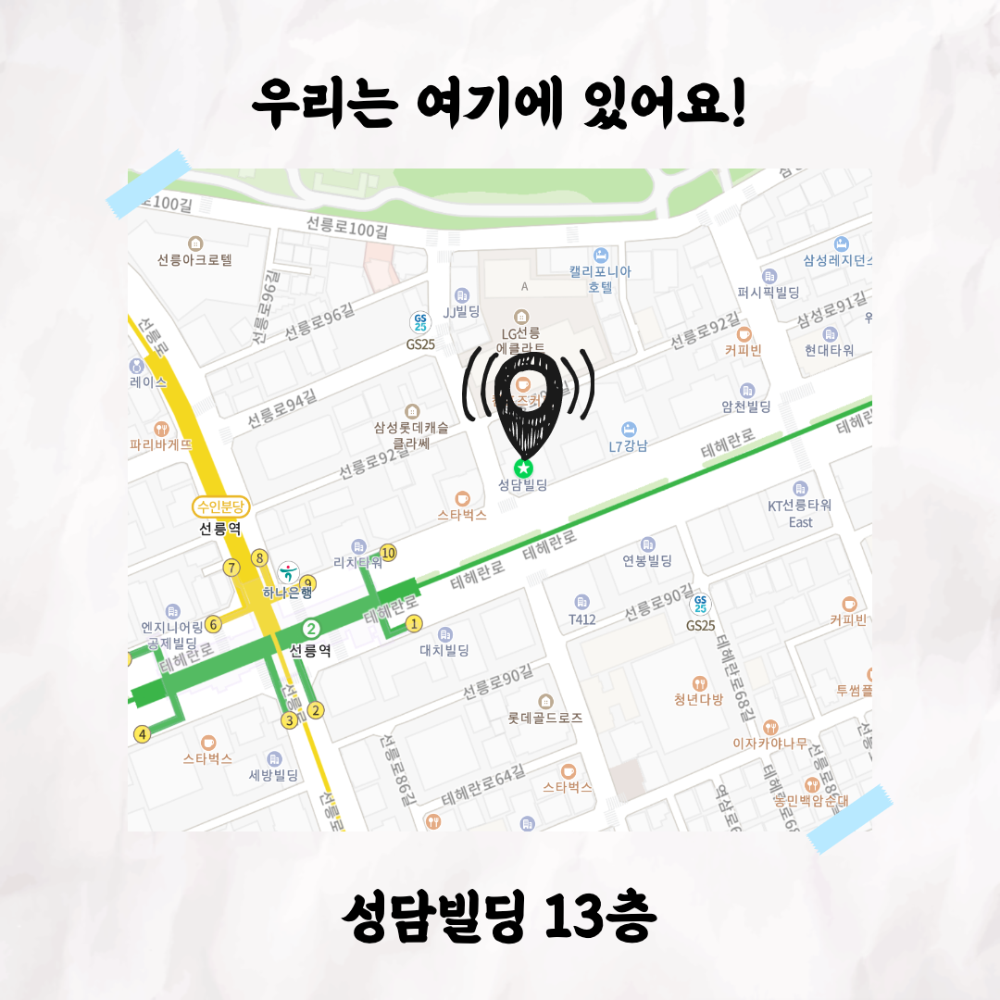
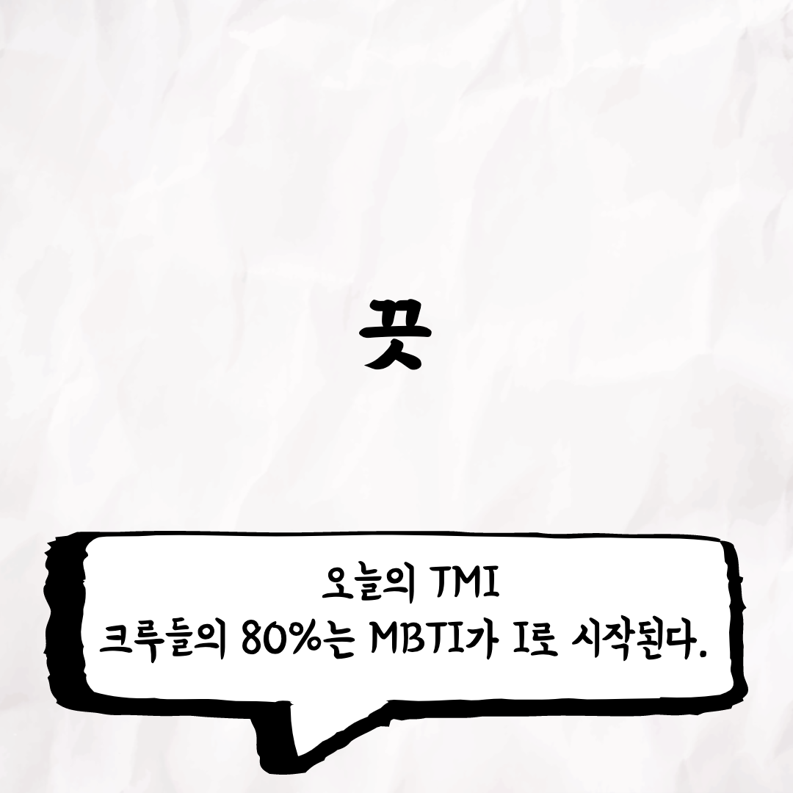

<<<<<<< HEAD
### 선릉캠퍼스 소개 초본

### 글

📮 <캠퍼스 소개 - 선릉편> 소식

선릉 캠퍼스를 소개합니다.
선릉에 있는 캠퍼스는 테크살롱이라고 불리는데요. 우주 컨셉으로 이루어져 있습니다.
선릉 캠퍼스에 대해 더 알고 싶다면 아래 링크로 접속해주세요!

선릉 캠퍼스(테크살롱) : [https://story.baemin.com/3168/](https://story.baemin.com/3168/)

우아한Tech 유튜브 : [https://www.youtube.com/c/%EC%9A%B0%EC%95%84%ED%95%9CTech](https://www.youtube.com/c/%EC%9A%B0%EC%95%84%ED%95%9CTech)

우아한테크코스 홈페이지 : [https://woowacourse.github.io](https://woowacourse.github.io/)

우테코 블로그(Tecoble) : [https://tecoble.techcourse.co.kr](https://tecoble.techcourse.co.kr/)

#우아한테크코스 #우테코 #잠실 #테크살롱 #선릉 #부트캠프 #java #javascript #spring #react #개발문화 #개발 #개발자 #wooteco #techcourse
=======
>>>>>>> da32f53c7fc1b3e412f439a7c0a0fd7effbe00b6
