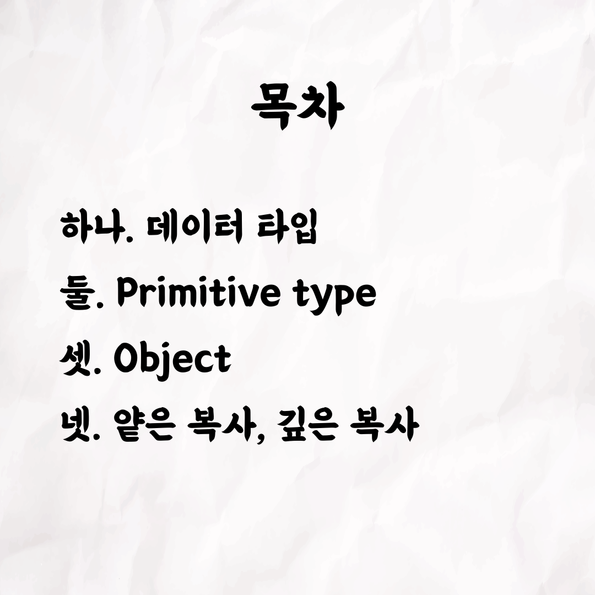
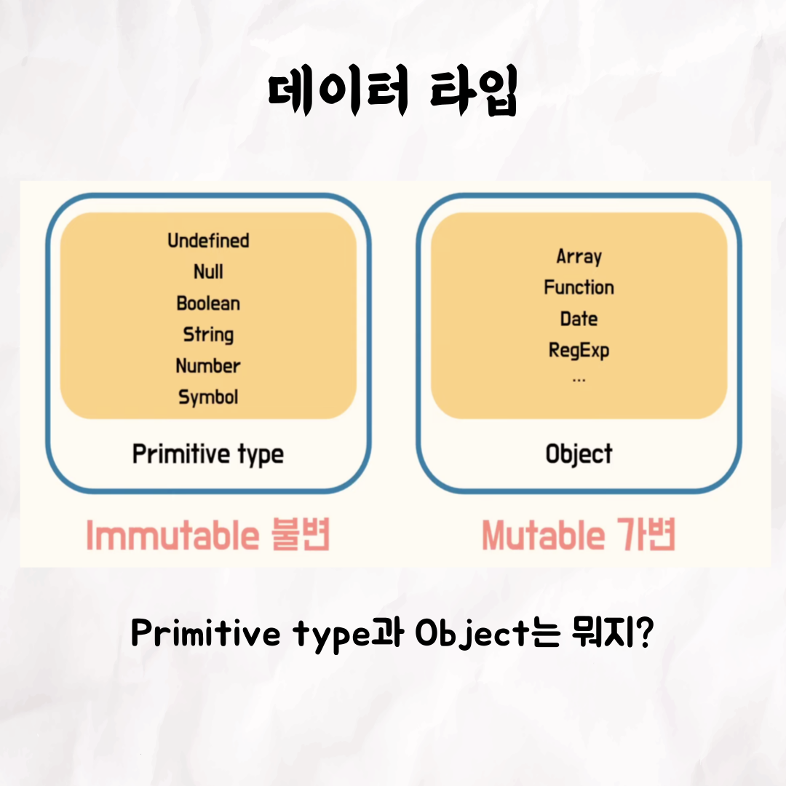
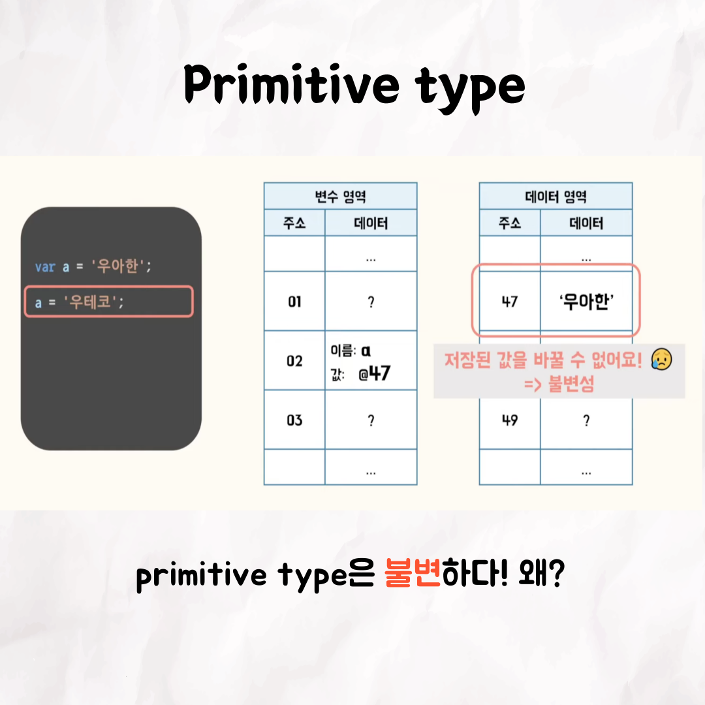
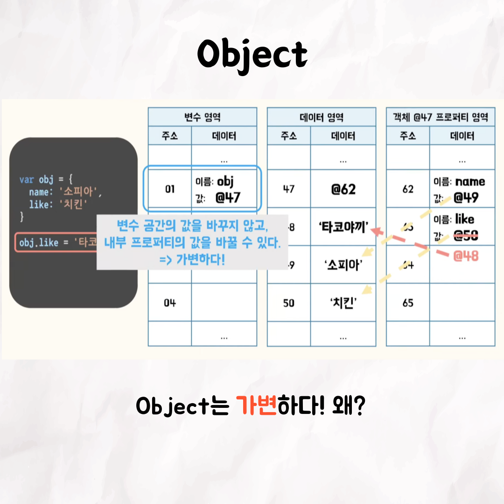
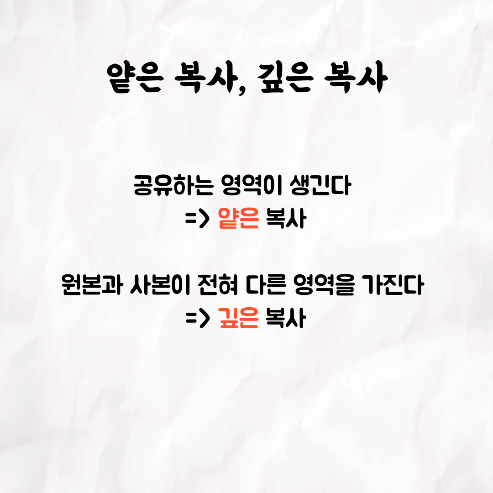

### 사진순서

### 글

📮 <테코톡 - 데이터 타입과 불변성(소피아)>

우아한테크코스에서 크루들이 발표하는 테코톡을 소개합니다.

데이터 타입과 불변성이란 무엇일까요?

⬇️ ⬇️ 데이터 타입과 불변성에 대해서 더 자세한 내용은 아래 링크를 참고해 주세요 ⬇️ ⬇️

우아한Tech 데이터 타입과 불변성 유튜브: https://www.youtube.com/watch?v=hM8s3ZaycGk

우아한Tech 유튜브 : https://www.youtube.com/c/%EC%9A%B0%EC%95%84%ED%95%9CTech

우아한테크코스 홈페이지 : https://woowacourse.github.io

우테코 블로그(Tecoble) : https://tecoble.techcourse.co.kr

#우아한테크코스 #우테코 #유튜브 #테코톡 #가변 #불변 #데이터 타입 #불변성 #개발 #개발자 #프론트엔드 #자바스크립트
