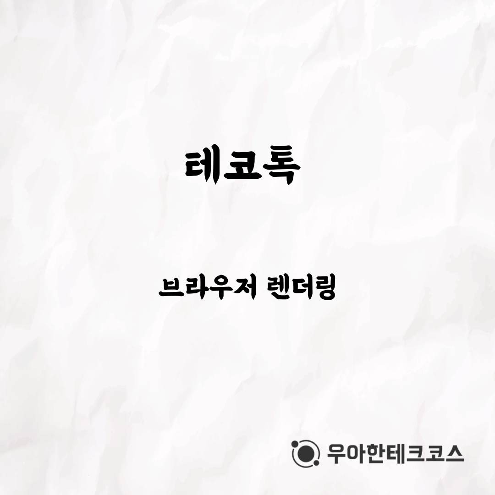
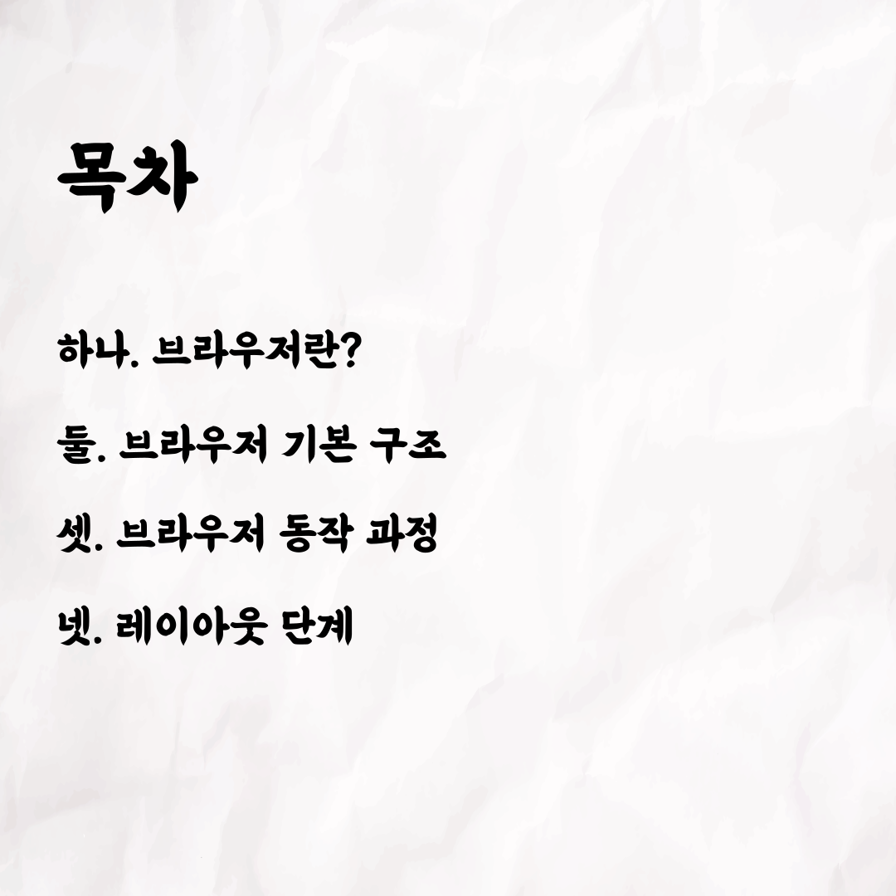
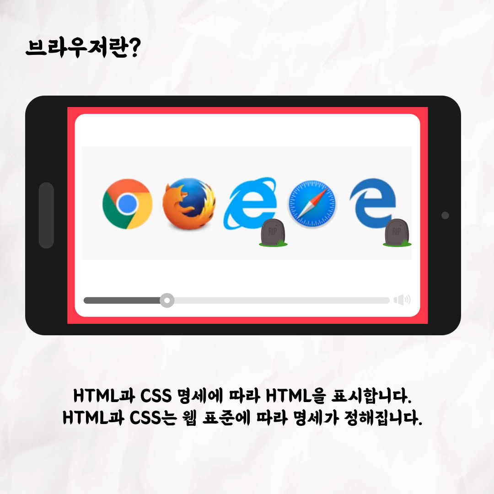
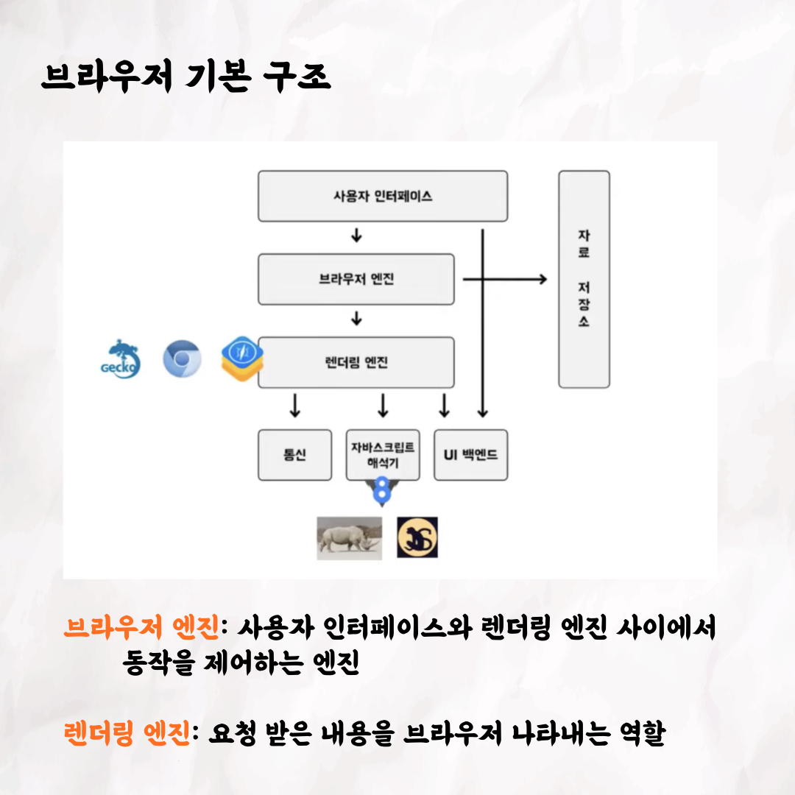
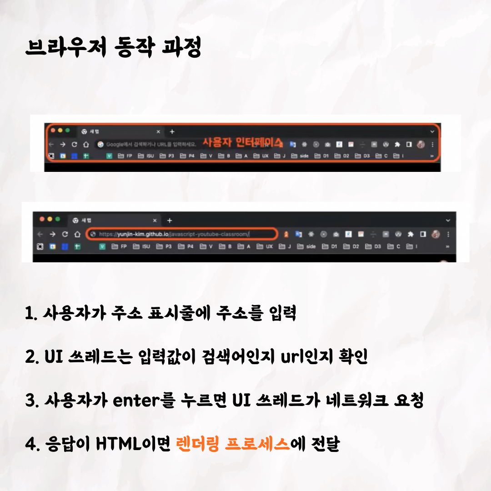
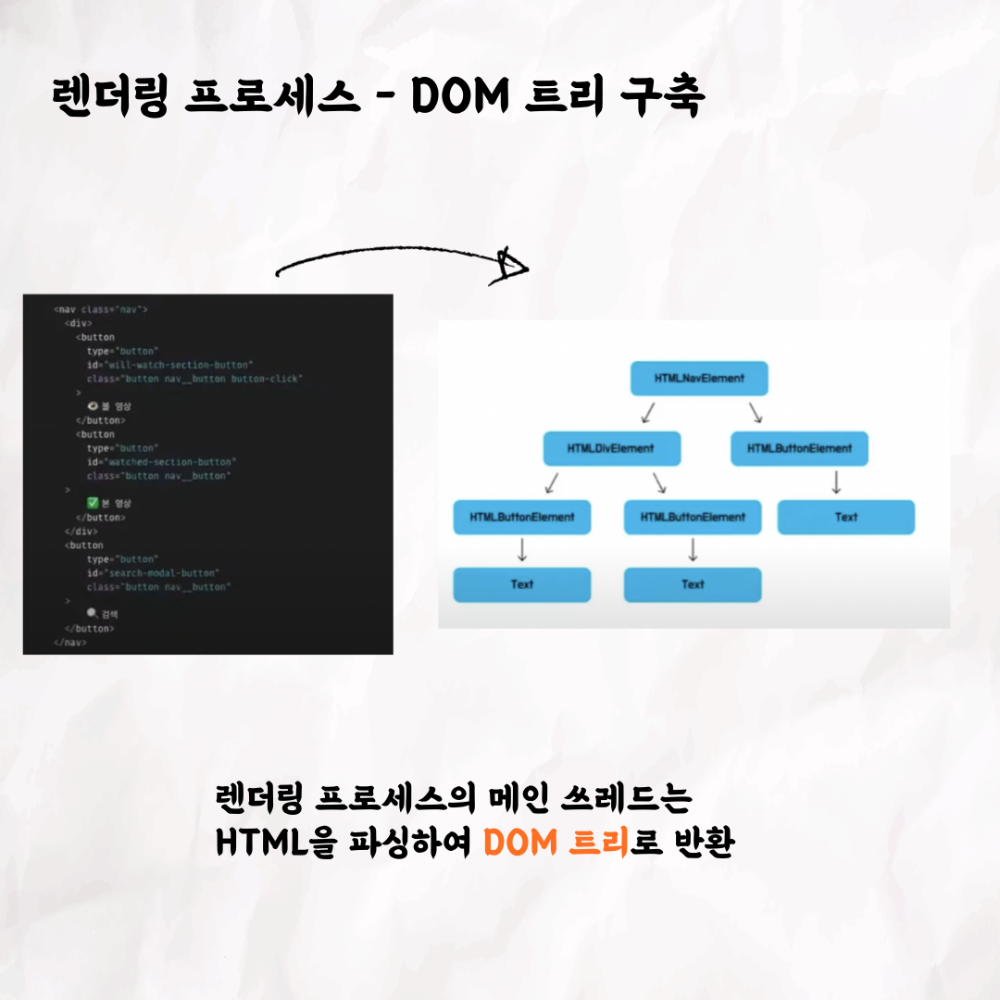
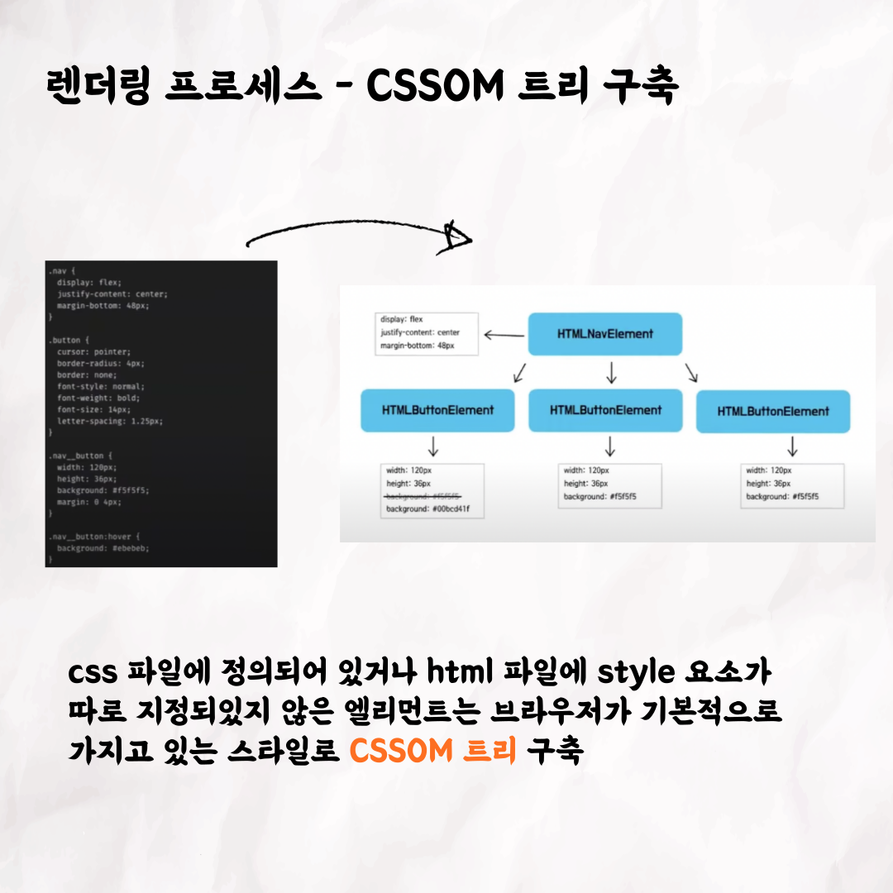
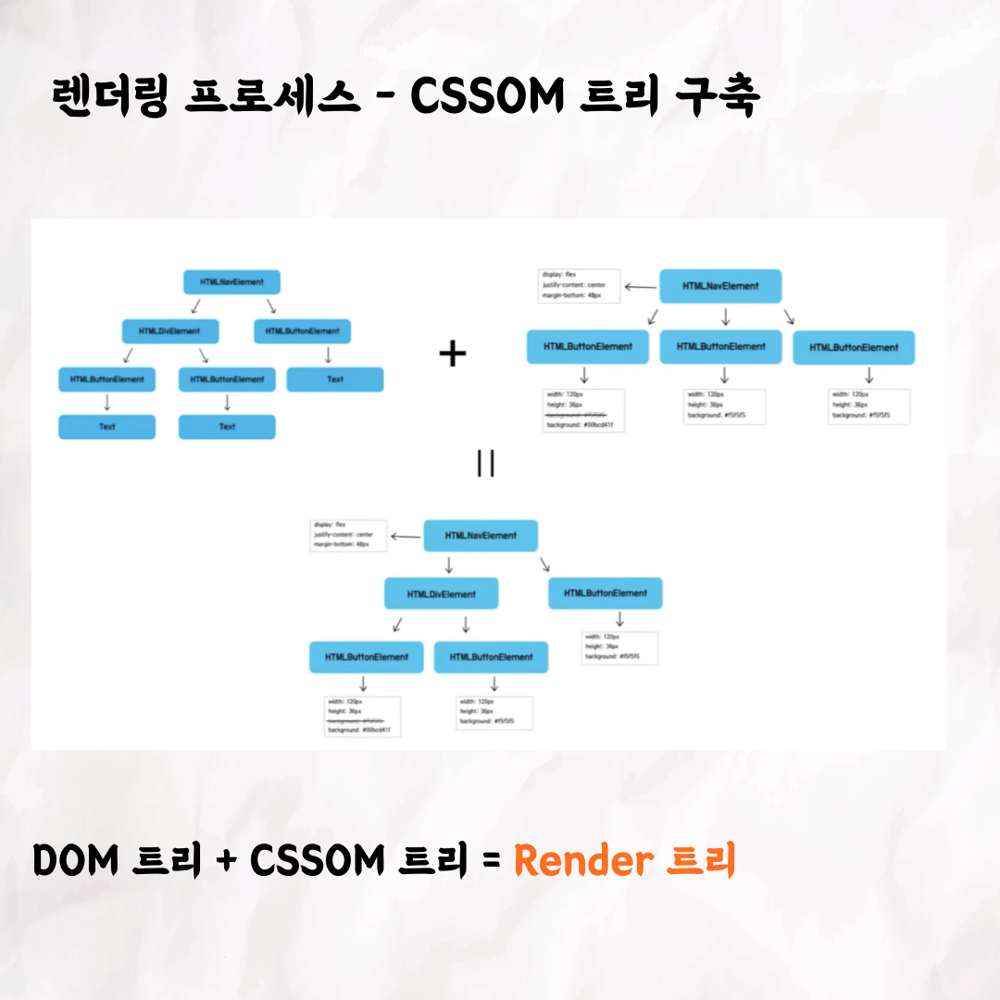
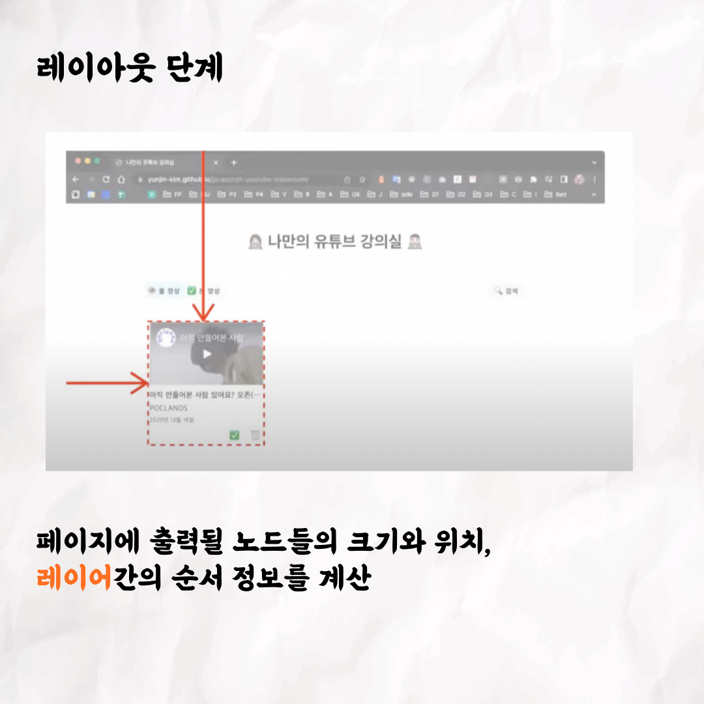
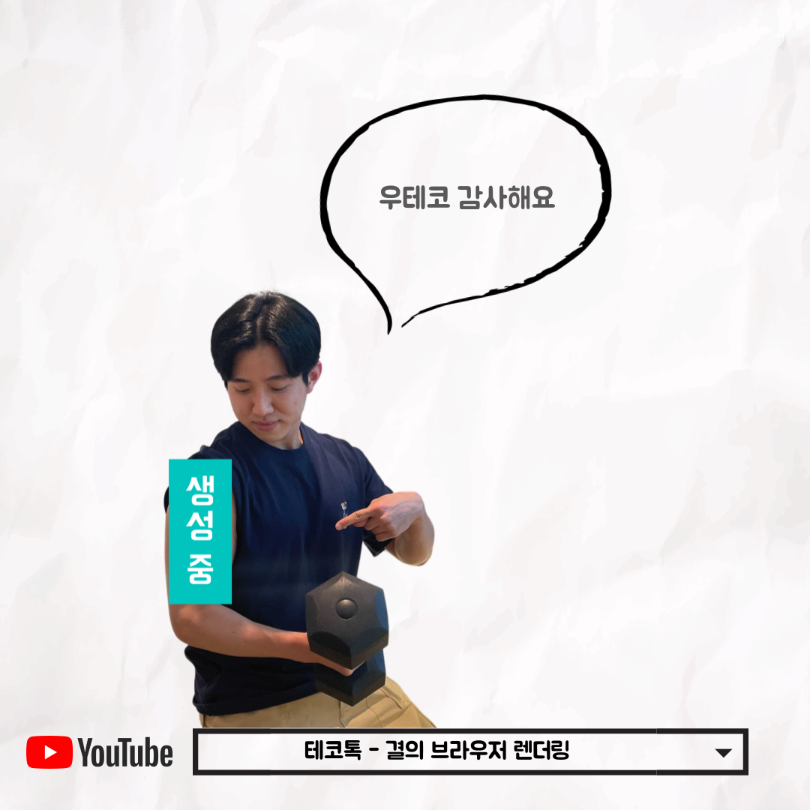

### 테코톡 - 결의 브라우저 렌더링

📮 테코톡

주제: 브라우저 렌더링

발표자: 결

우테코만의 문화인 테코톡에서 결이 브라우저 렌더링에 관련된 주제로 발표를 해주었어요👏
우리가 작성한 HTML, CSS가 웹 페이지로 보여질 수 있었을까요?
10분 남짓의 결의 테코톡 영상을 보면 브라우저 내부에서 어떻게 동작하는지 알 수 있어요!
추가로 리페인팅, 리플로우에 대한 개념이 헷갈리는 분들에게도 추천드립니다!!
영상은 유튜브에 "결의 브라우저 렌더링"으로 검색하시면 찾아보실 수 있습니다

우아한Tech 유튜브:https://www.youtube.com/c/%EC%9A%B0%EC%95%84%ED%95%9CTech

우아한테크코스 홈페이지:https://woowacourse.github.io

우테코 블로그(Tecoble):https://tecoble.techcourse.co.kr

#우아한테크코스#우테코#테코톡#개발자#java#javascript#spring#react#개발문화#개발#개발자#woowahantechcourse#wooteco#techcourse#브라우저렌더링#브라우저#browser#HTML#CSS