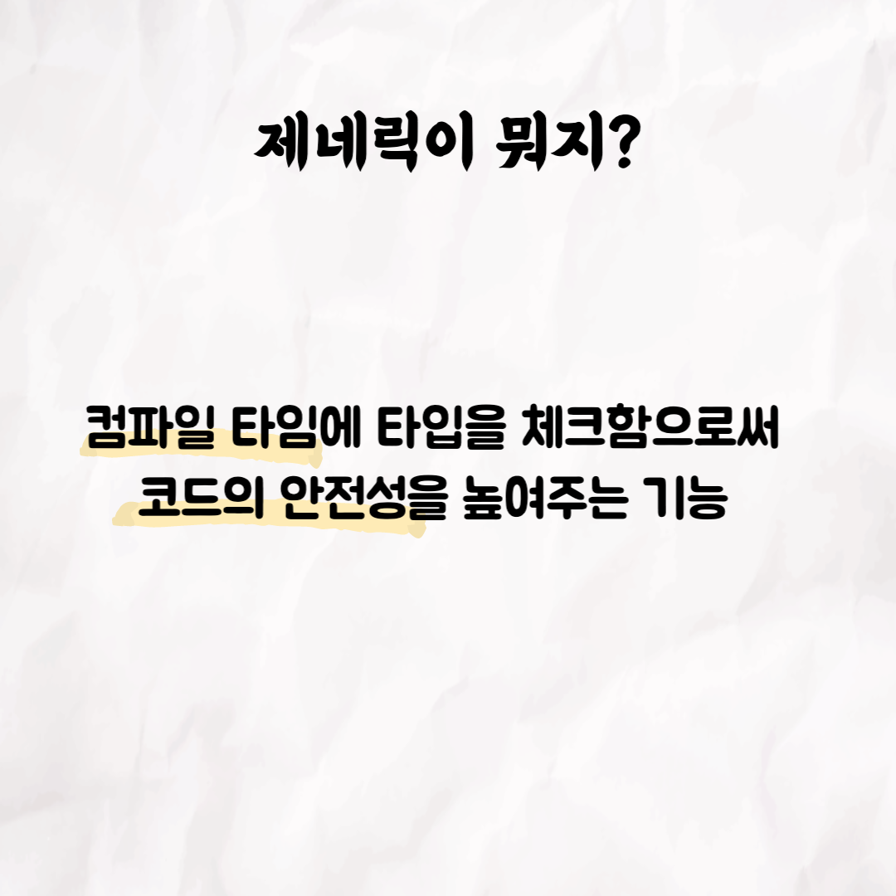
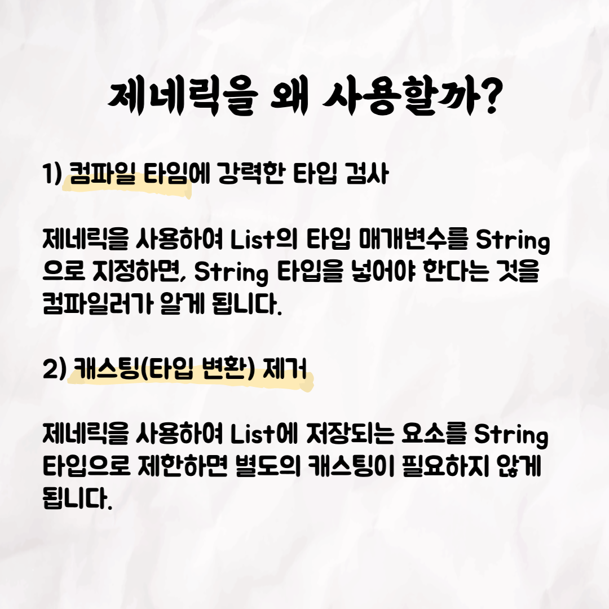

### 테코톡 - 그린론의 제네릭

📮 테코톡

주제: 제네릭

발표자: 그린론🙋🏻‍♀️

우테코만의 문화인 테코톡에서 그린론이 Java 제네릭에 관련된 주제로 발표를 해주었어요👏 제네릭에 대해 아직 생소하신 분들은 영상을 시청하시는 것을 강력 추천합니다! 10분 남짓한 길이라 부담없이 편하게 들으실 수 있어요!

 영상은 유튜브에 "그린론의 제네릭"으로 검색하시면 찾아보실 수 있습니다

우아한Tech 유튜브:https://www.youtube.com/c/%EC%9A%B0%EC%95%84%ED%95%9CTech

우아한테크코스 홈페이지:https://woowacourse.github.io

우테코 블로그(Tecoble):https://tecoble.techcourse.co.kr

#우아한테크코스#우테코#테코톡#개발자#java#javascript#spring#react#개발문화#개발#개발자#woowahantechcourse#wooteco#techcourse