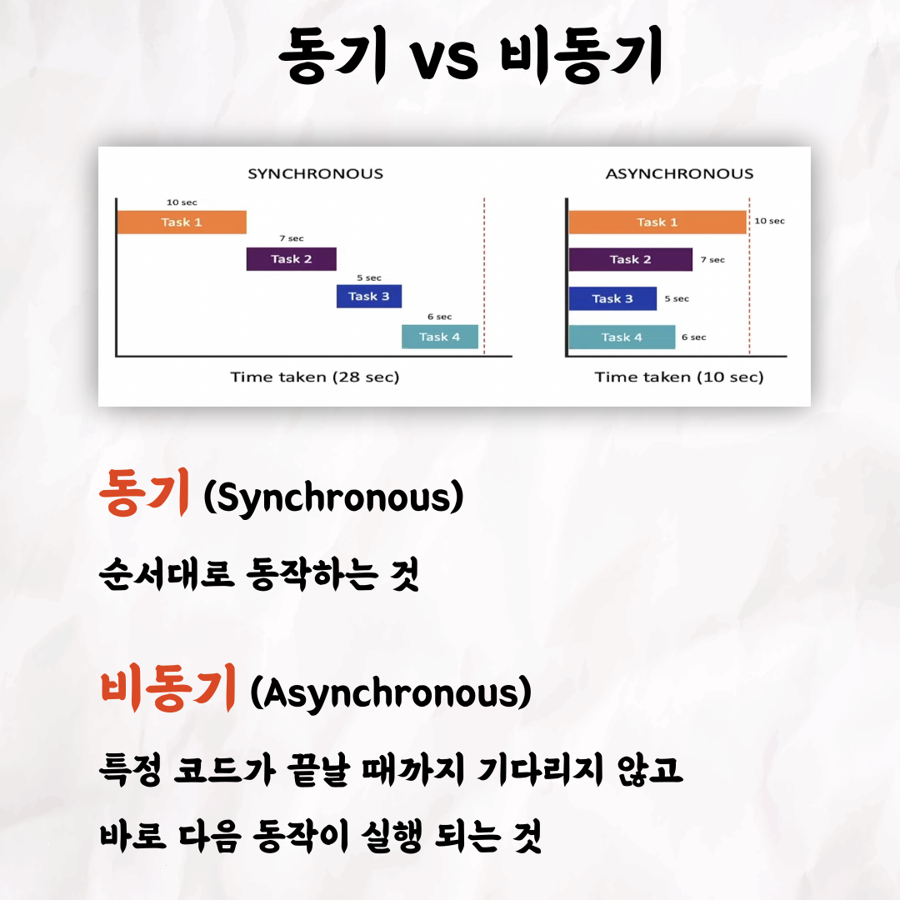
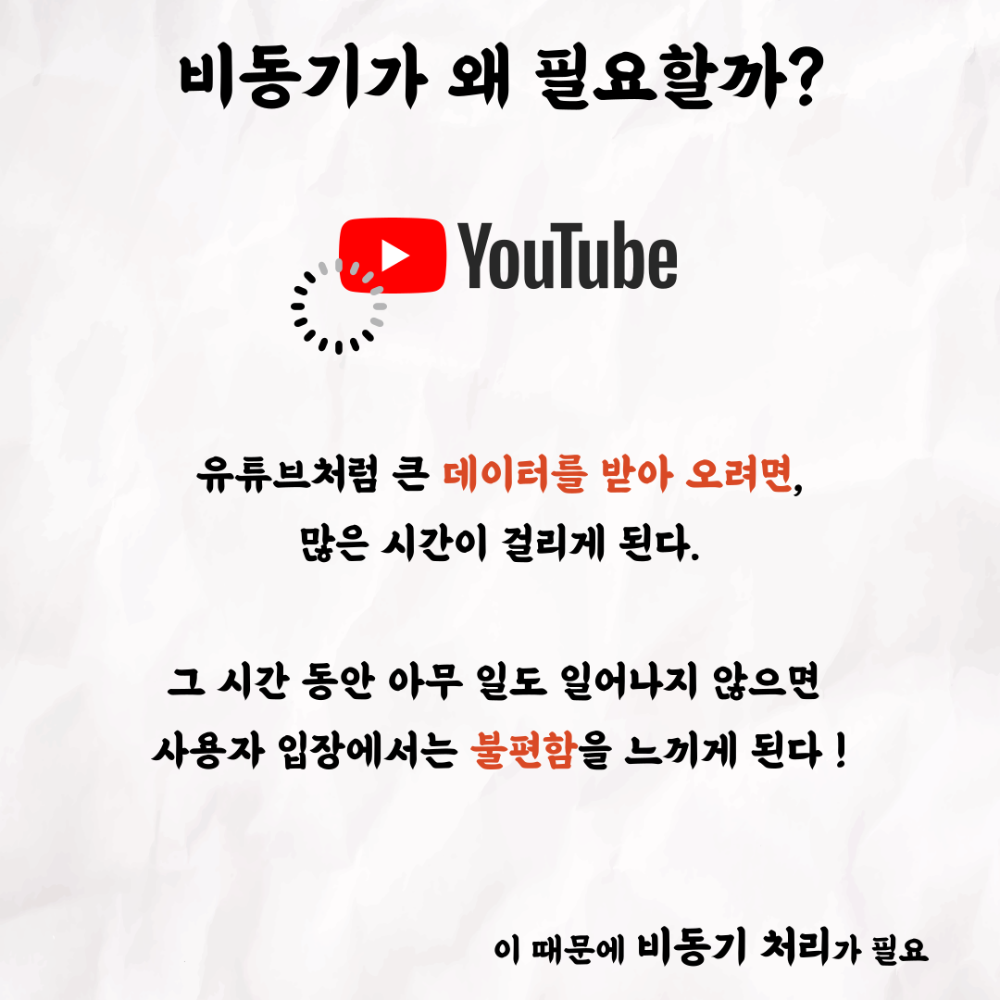
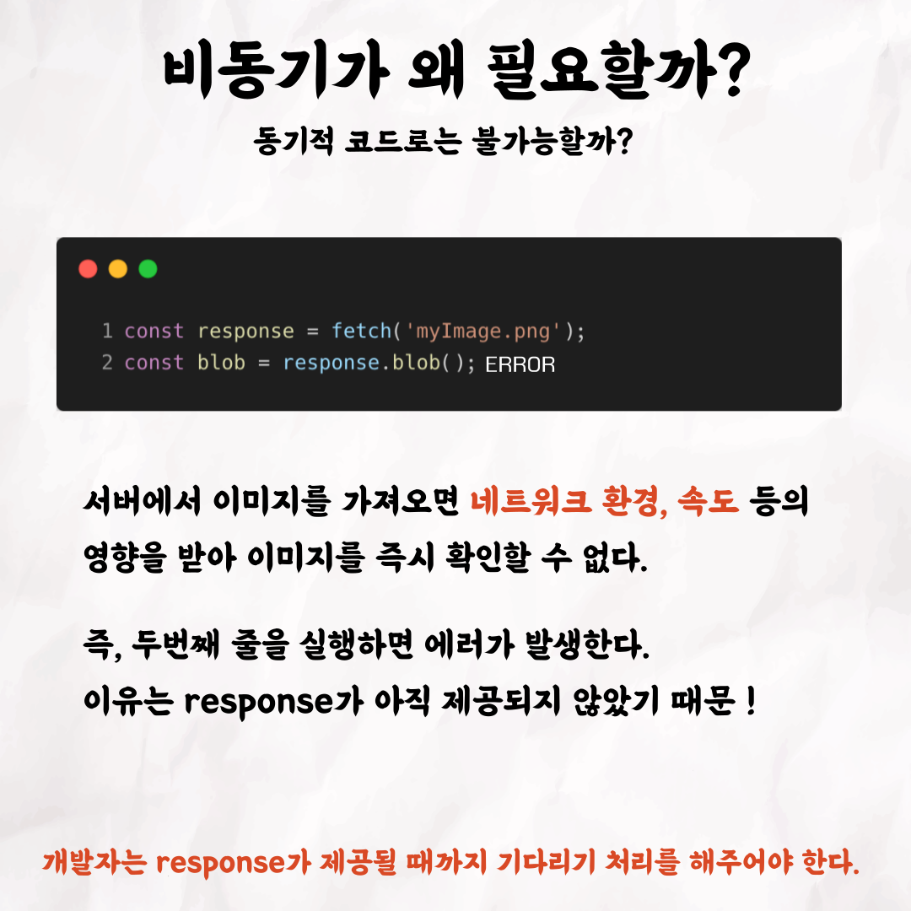
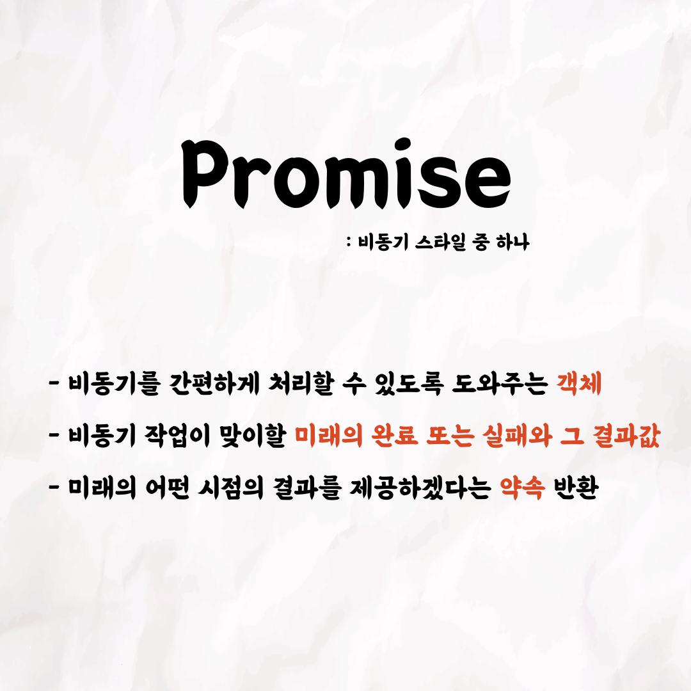
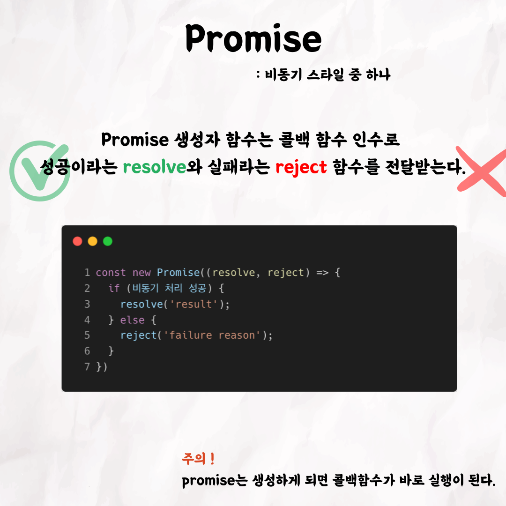
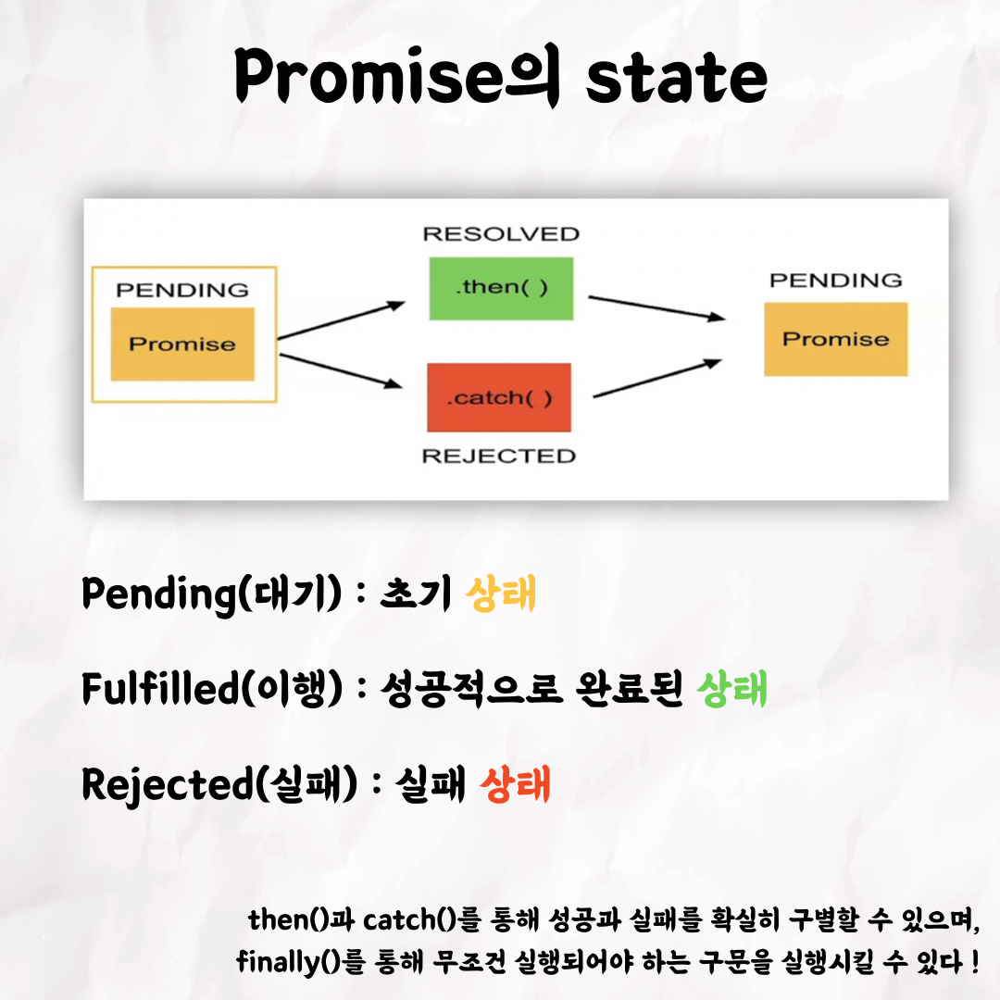
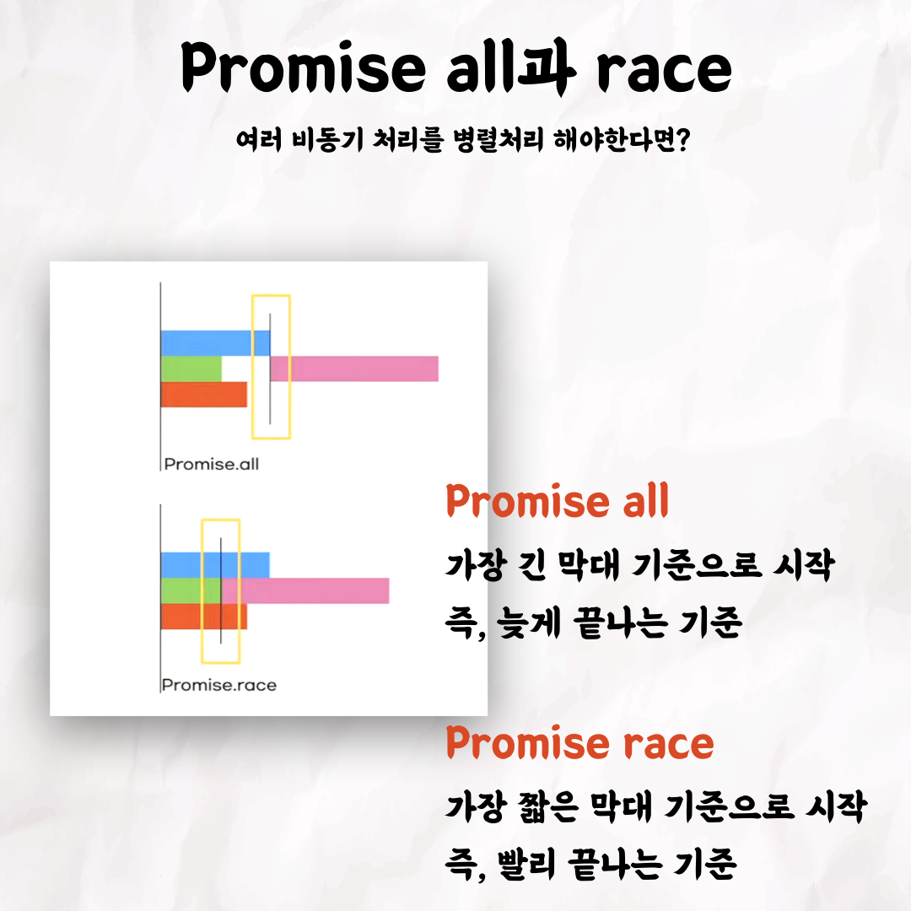

## 안의 비동기 처리 - promise

### 1번 - 표지

### 2번

### 3번

### 4번

### 5번

### 6번

### 7번

### 8번

### 9번

### 10번

 

테코톡 👩🏻‍💻🧑🏻‍💻  
  
주제 : 비동기 처리 - promise  
  
발표자 : 안  

동기는 뭐고, 비동기는 뭐지?  
왜 비동기 작업이 필요할까요?  
너무 어려운 비동기에 대한 이해! 안이 promise를 통해 간단하게 설명해드립니다 🧐  

영상은 유튜브에 "안의 비동기처리 promise"로 검색하시면  
찾아보실 수 있습니다.  

우아한Tech 유튜브 : https://www.youtube.com/c/%EC%9A%B0%EC%95%84%ED%95%9CTech

우아한테크코스 홈페이지 : https://woowacourse.github.io

우테코 블로그(Tecoble) : https://tecoble.techcourse.co.kr

#우아한테크코스 #우테코 #잠실 #선릉 #부트캠프 #java #javascript #spring #react #개발문화 #개발 #개발자 #wooteco #techcourse #테코톡 #tecotalk #promise
