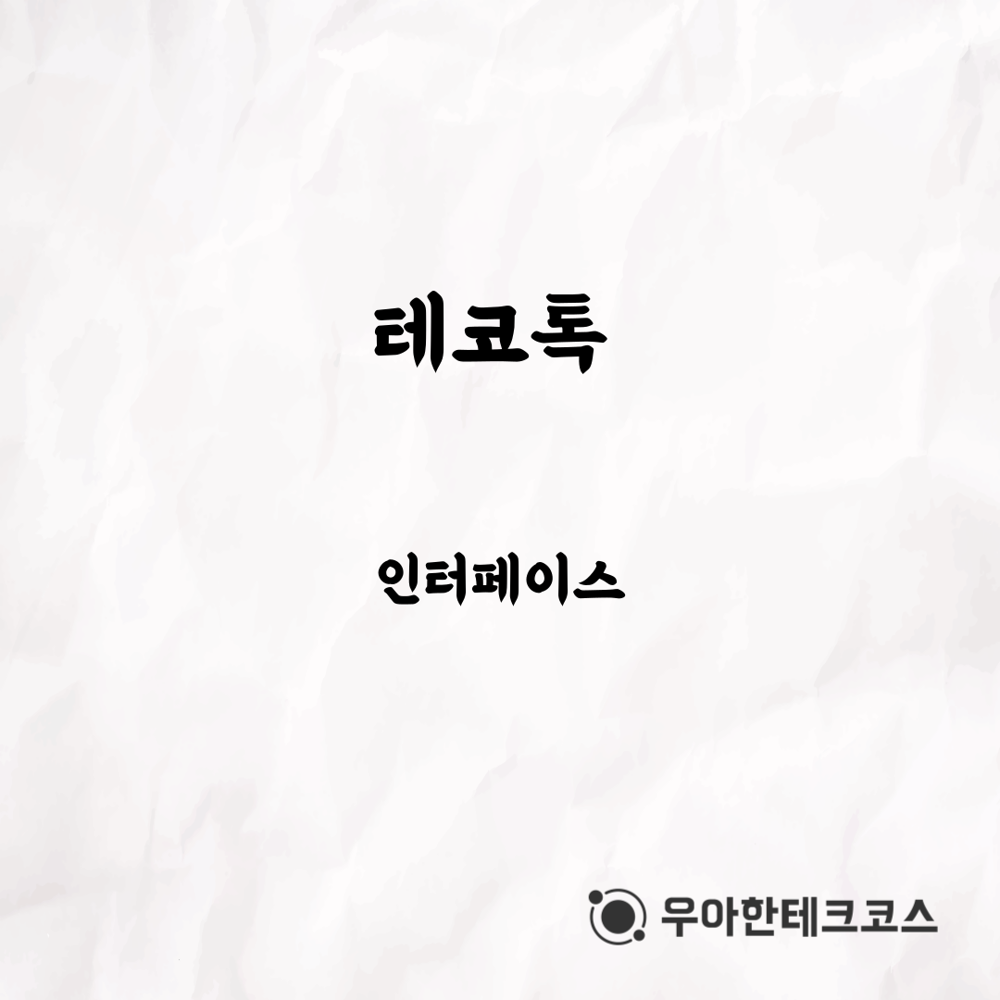
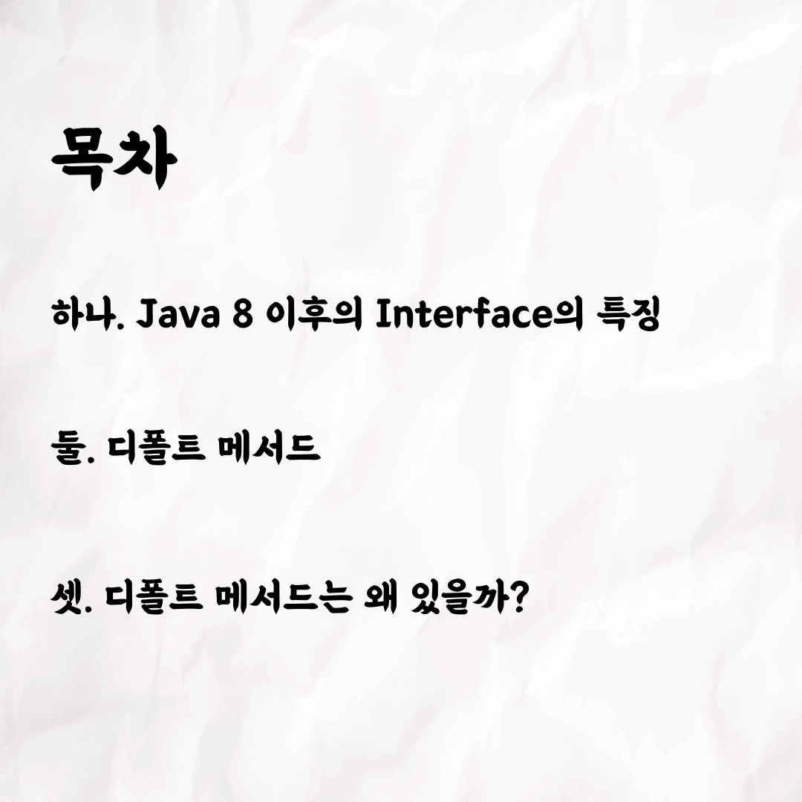
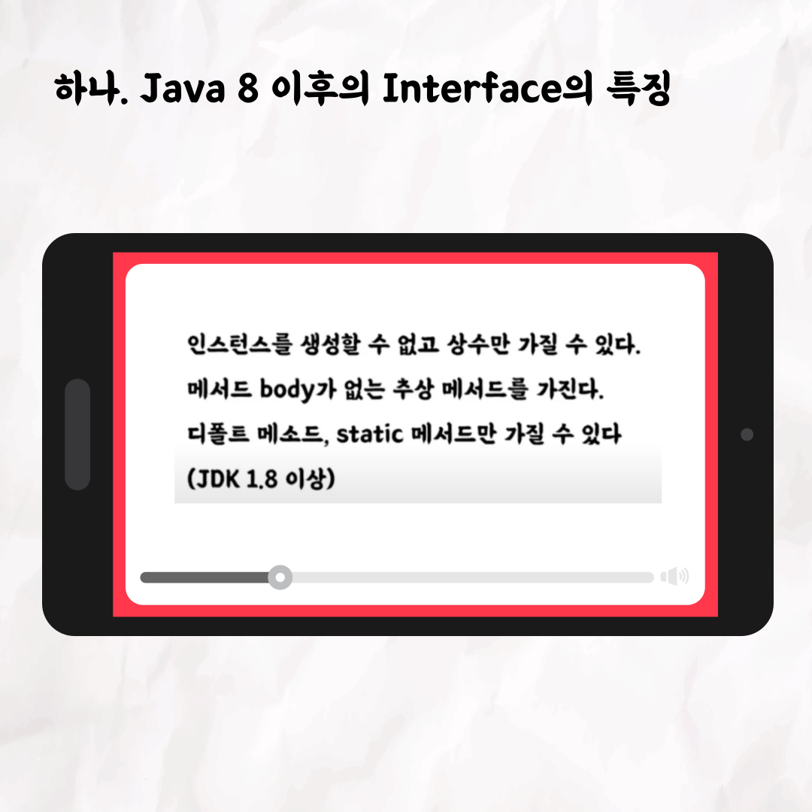
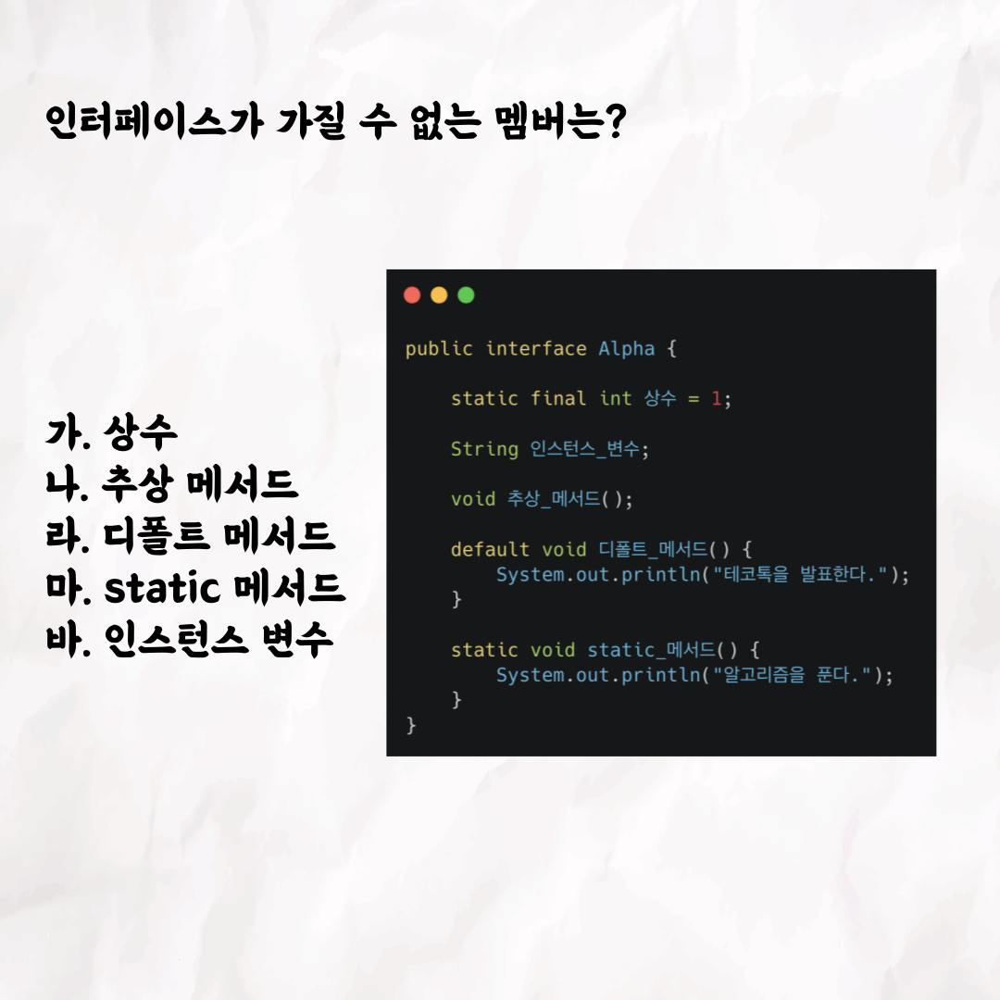
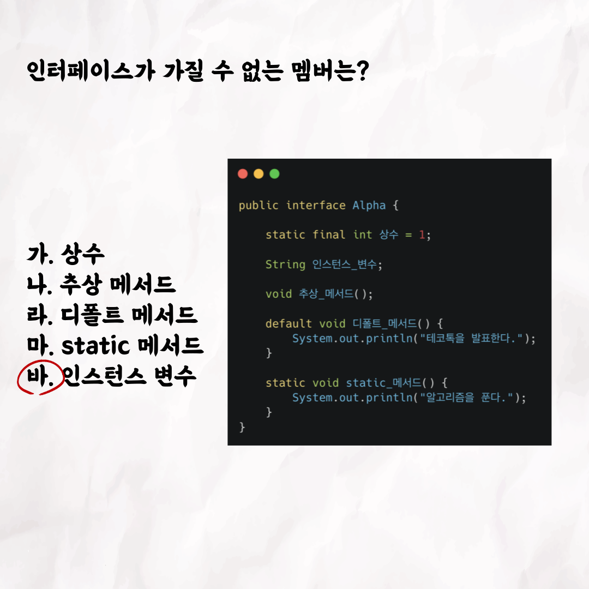
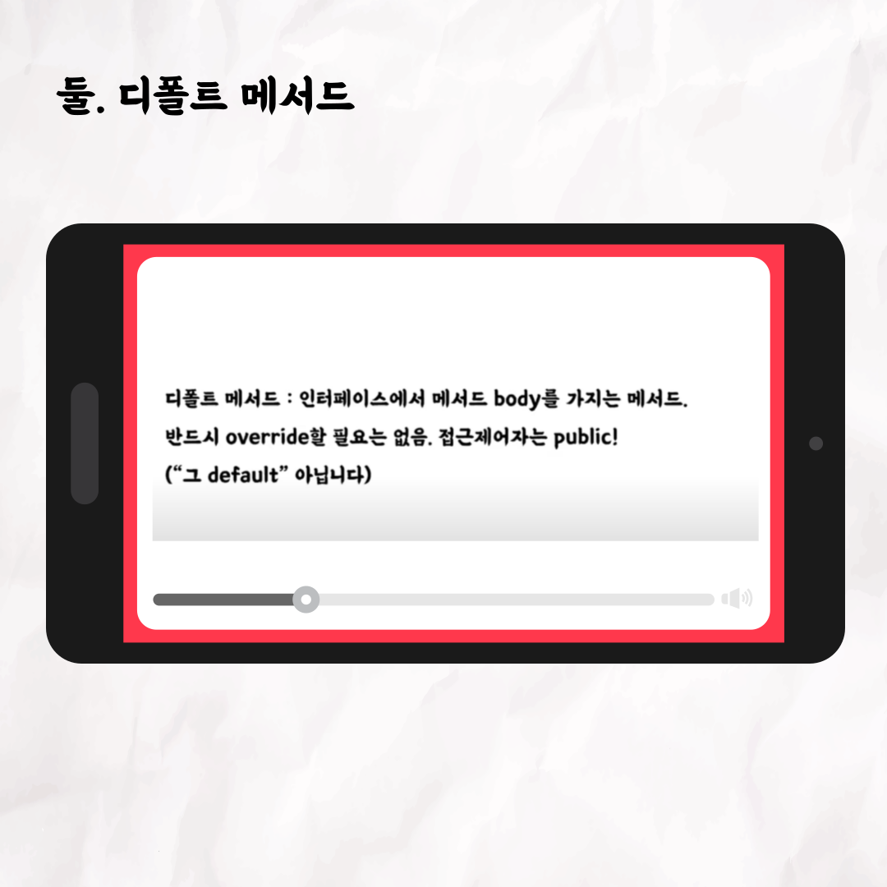
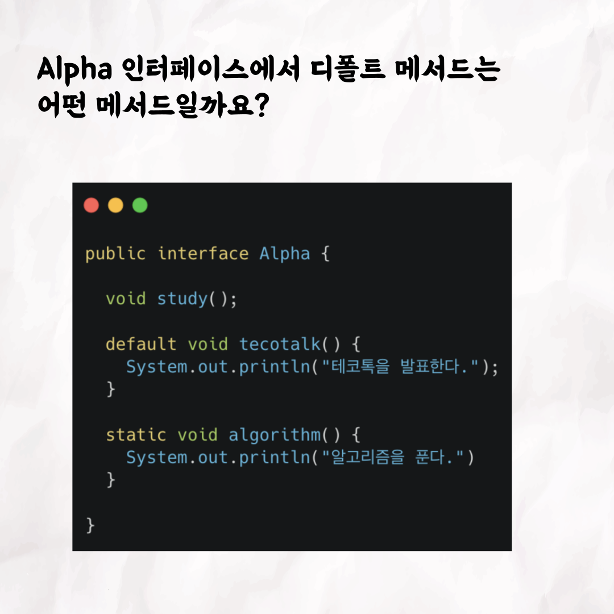
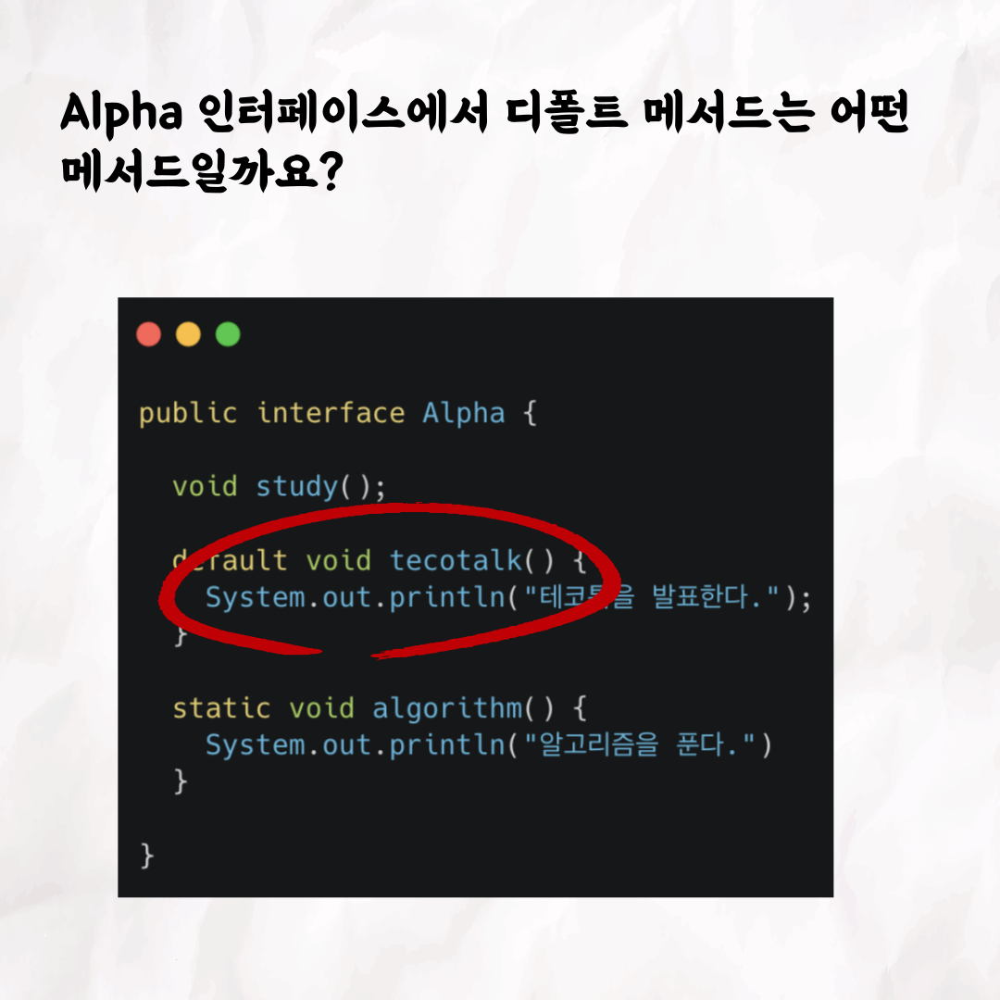
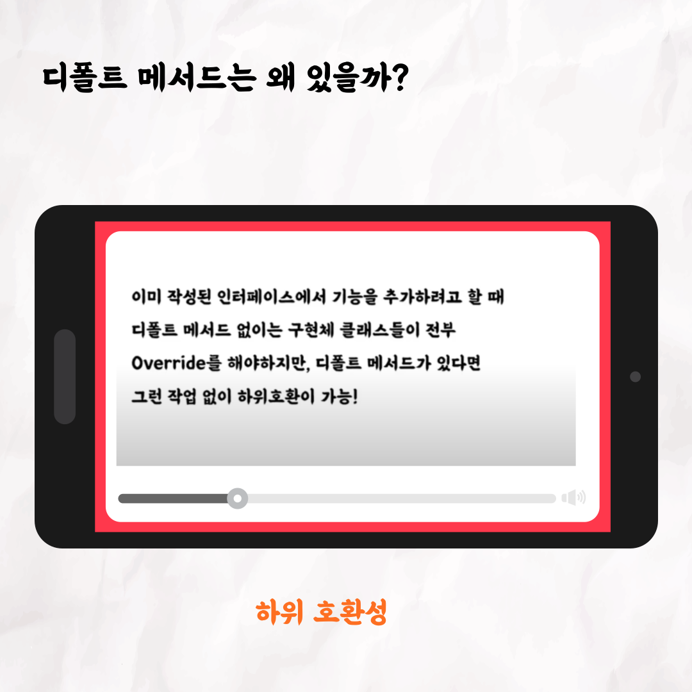

### 테코톡 - 알파의 Parameter와 Argument

📮 테코톡

주제: 인터페이스

발표자: 알파 ⍺

우테코만의 문화인 테코톡에서 알파가 인터페이스에 관련된 주제로 발표를 해주었어요👏
java 8 이 후 인터페이스에 어떤 기능이 추가되었고 왜 이런 기능들이 추가되었는지 아주 자세히 설명해주었는데요.
객체 지향 프로그래밍과 뗄 수 없는 인터페이스를 알고 싶다면 10분 남짓의 알파의 테코톡을 들어보시는건 어떨까요?

영상은 유튜브에 "알파의 인터페이스"으로 검색하시면 찾아보실 수 있습니다

테코톡 영상 링크:https://www.youtube.com/watch?v=T1BJzC9xb0g&t=77s

우아한Tech 유튜브:https://www.youtube.com/c/%EC%9A%B0%EC%95%84%ED%95%9CTech

우아한테크코스 홈페이지:https://woowacourse.github.io

우테코 블로그(Tecoble):https://tecoble.techcourse.co.kr

#우아한테크코스#우테코#테코톡#개발자#java#javascript#spring#react#개발문화#개발#개발자#woowahantechcourse#wooteco#techcourse#인터페이스#interface#객체지향프로그래밍#다형성