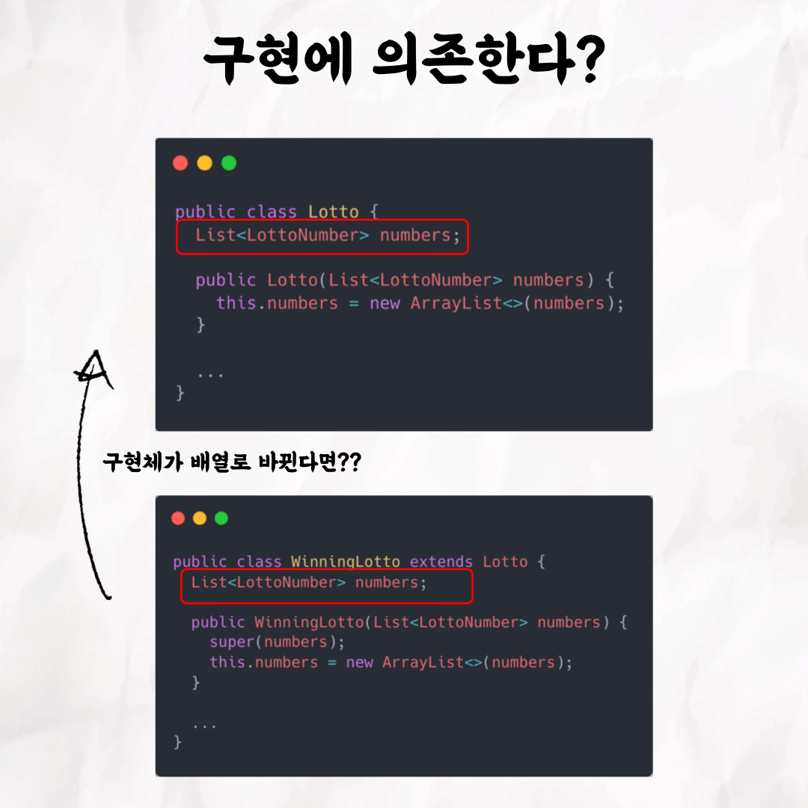
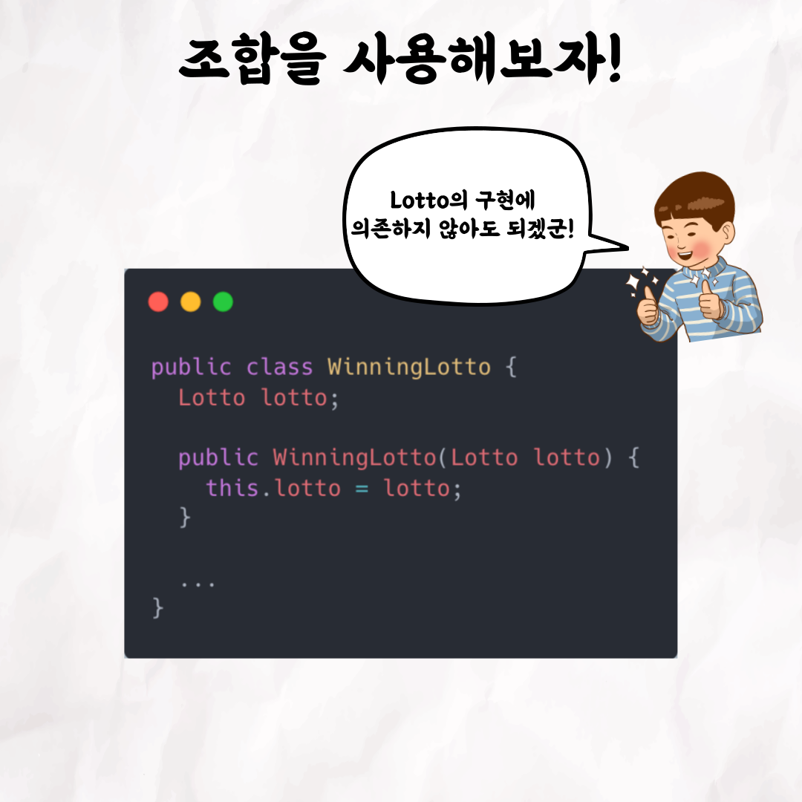
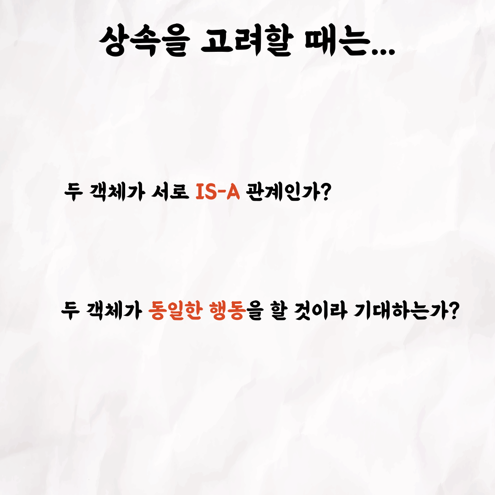

### 테코톡 - 클레이 상속 vs 조합

주제: 상속 vs 조합

발표자: 클레이

우테코 백엔드 크루 클레이가 상속과 조합에 대해 테코톡 발표를 했어요 👏 

상속은 무엇이고 조합은 무엇인지, 또 언제 상속을 써야하고 언제 조합을 써야할지 궁금하지 않으신가요? 

영상은 유튜브에 "테코톡 클레이 상속 vs 조합"으로 검색하시면 찾아보실 수 있습니다

우아한Tech 유튜브:https://www.youtube.com/c/%EC%9A%B0%EC%95%84%ED%95%9CTech

우아한테크코스 홈페이지:https://woowacourse.github.io

우테코 블로그(Tecoble):https://tecoble.techcourse.co.kr

#우아한테크코스#우테코#테코톡#개발자#java#javascript#spring#react#개발문화#개발#개발자#woowahantechcourse#wooteco#techcourse