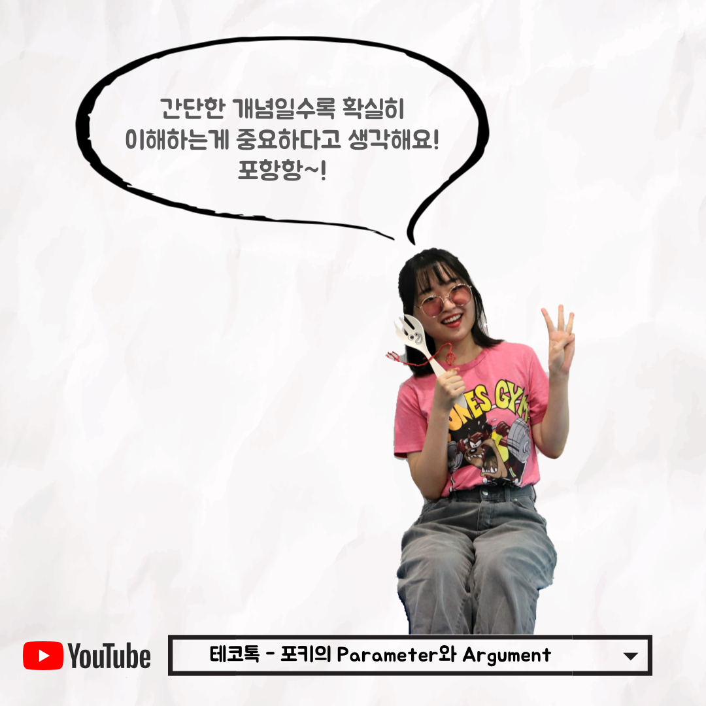

### 테코톡 - 오리 & 코린의 Merge, Rebase, Cherry-pick

📮 테코톡

주제: Parameter와 Argument

발표자: 포키🍴

우테코만의 문화인 테코톡에서 포키가 Parameter와 Argument에 관련된 주제로 발표를 해주었어요👏
메서드 또는 함수를 사용하면서 두 용어가 간혹 햇갈리진 않으셨나요? 간단한 개념이더라도 확실히 이해하고 용어를 사용하는 것도 매우 중요한 것 같아요!
영상 중간중간 포키가 내주는 문제와 포키뉴스~! 등 재밌는 요소들이 많으니 출퇴근 시간 또는 쉬는 날 보시는 것을 강력히 추천합니다!

 영상은 유튜브에 "포키의 Parameter와 Argument"으로 검색하시면 찾아보실 수 있습니다

우아한Tech 유튜브:https://www.youtube.com/c/%EC%9A%B0%EC%95%84%ED%95%9CTech

우아한테크코스 홈페이지:https://woowacourse.github.io

우테코 블로그(Tecoble):https://tecoble.techcourse.co.kr

#우아한테크코스#우테코#테코톡#개발자#java#javascript#spring#react#개발문화#개발#개발자#woowahantechcourse#wooteco#techcourse