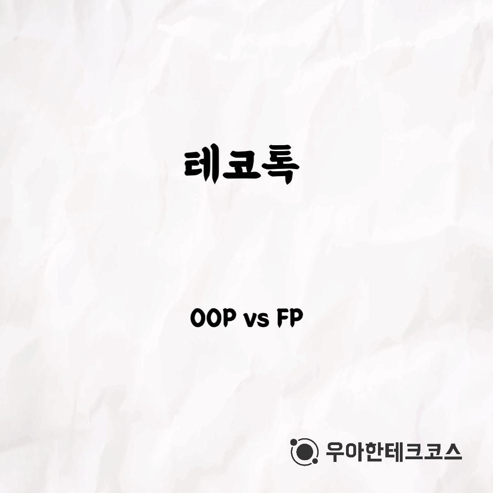
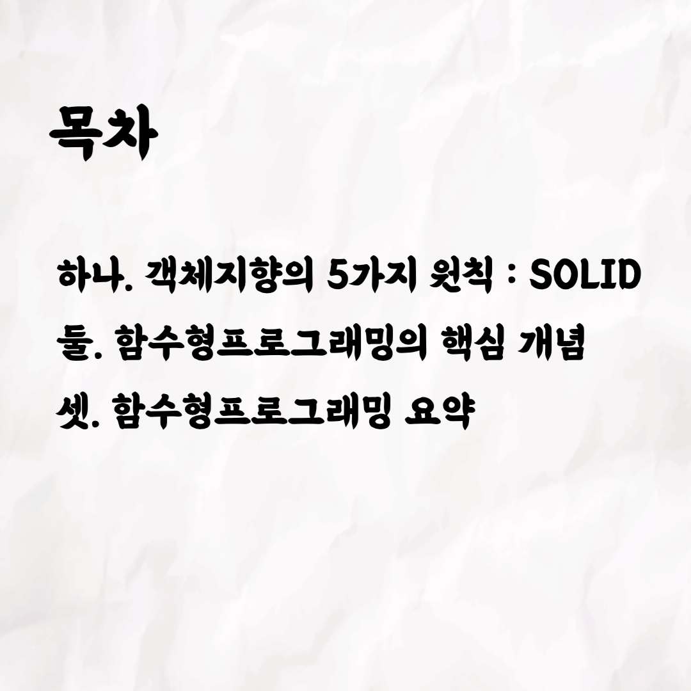
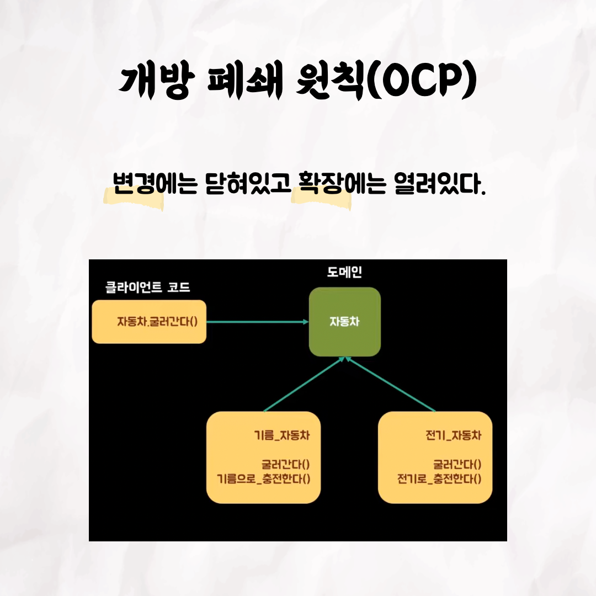
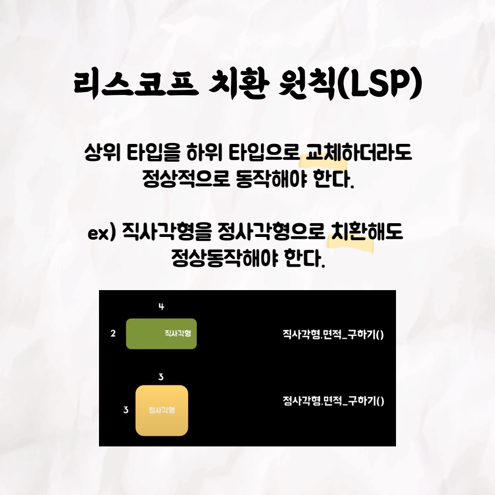
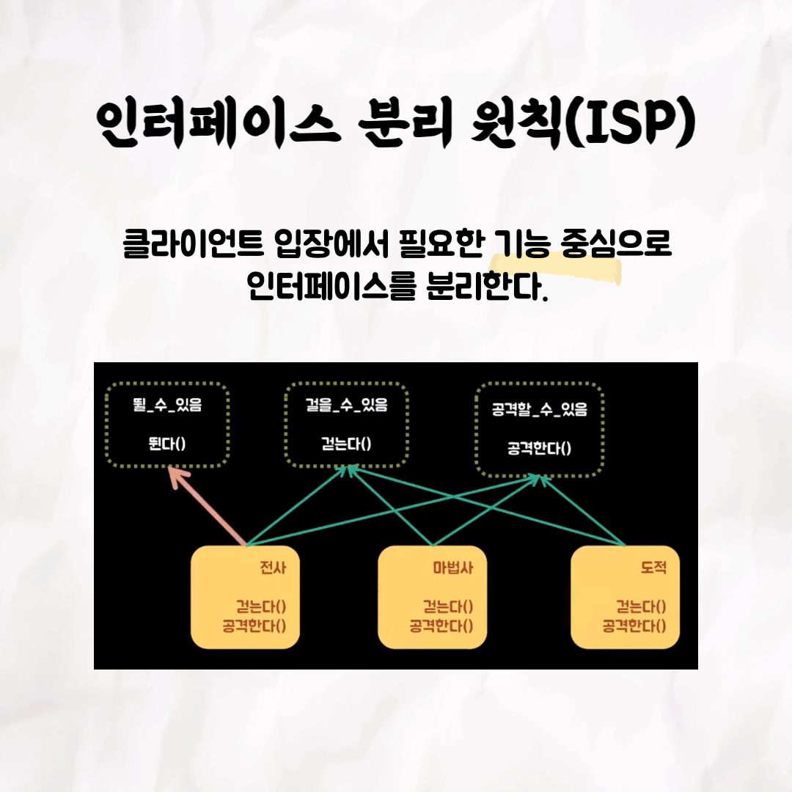
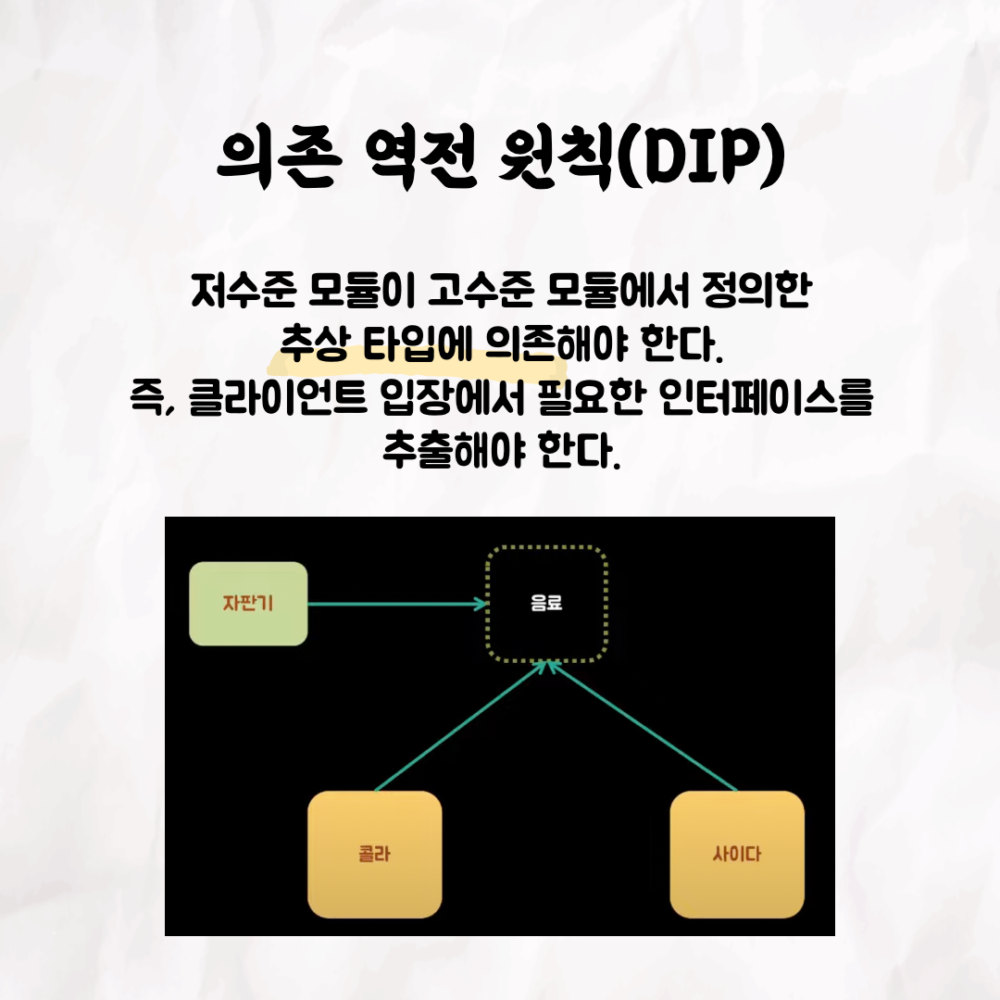
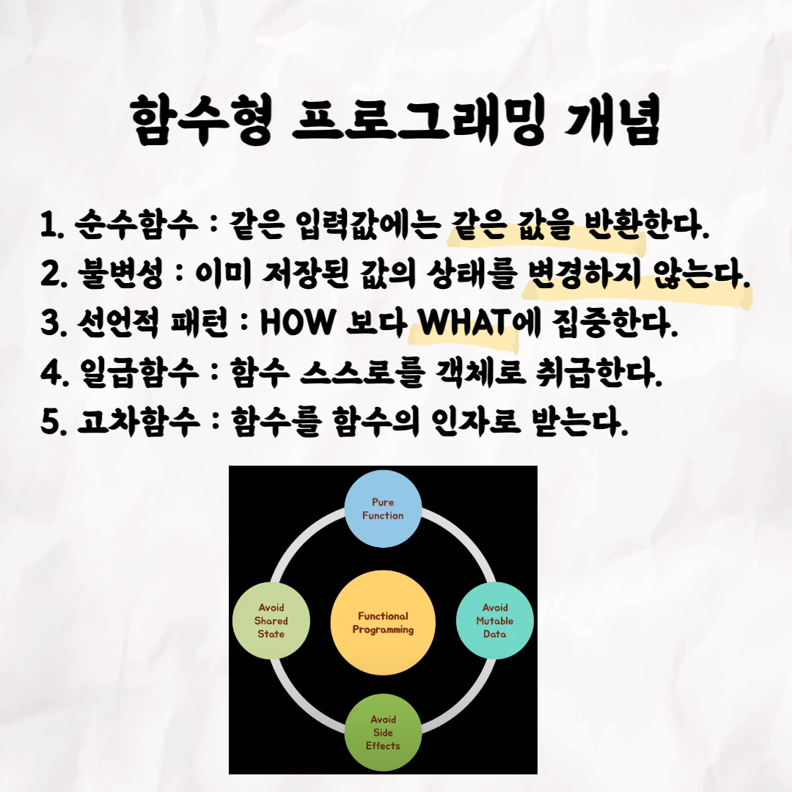
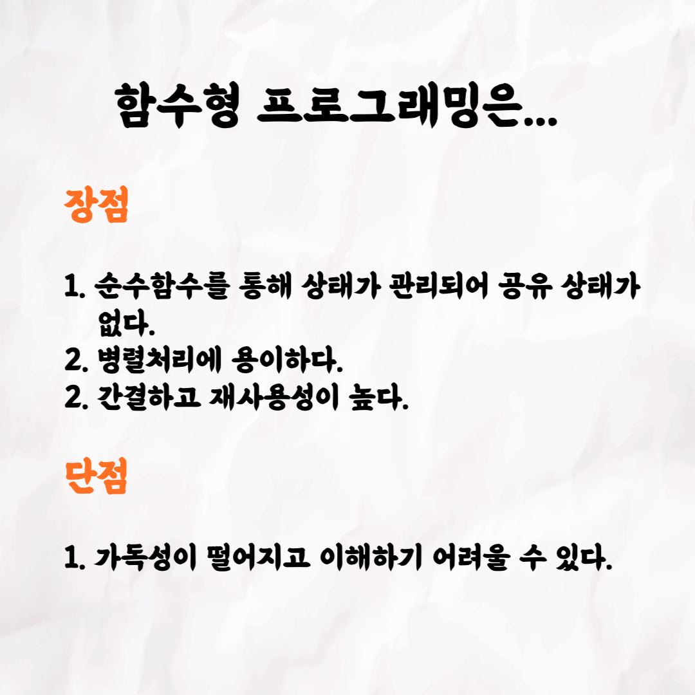
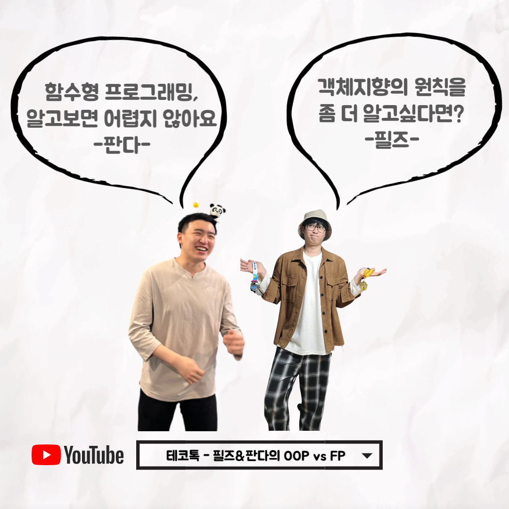

### 테코톡 - 필즈 & 판다의 OOP vs FP

📮 테코톡

주제: OOP vs FP

발표자: 필즈, 판다

우테코만의 문화인 테코톡에서 필즈와 판다가 OOPvsFP라는 주제로 발표를 해주었어요👏 객체지향 프로그래밍의 원칙인 SOLID와 함수형 프로그래밍의 개념에 대해 깊게 공부하고 싶으신 분들은 영상을 시청하는 것을 추천드려요! 영상 길이는 10분 ~ 20분 정도로 출퇴근을 하시는 직장인, 등하교를 하는 학생들에게 부담되지 않고 편하게 들으실 수 있어요!

 영상은 유튜브에 "필즈&판다의 OOP vs FP"으로 검색하시면 찾아보실 수 있습니다

우아한Tech 유튜브:https://www.youtube.com/c/%EC%9A%B0%EC%95%84%ED%95%9CTech

우아한테크코스 홈페이지:https://woowacourse.github.io

우테코 블로그(Tecoble):https://tecoble.techcourse.co.kr

#우아한테크코스#우테코#테코톡#개발자#java#javascript#spring#react#개발문화#개발#개발자#woowahantechcourse#wooteco#techcourse