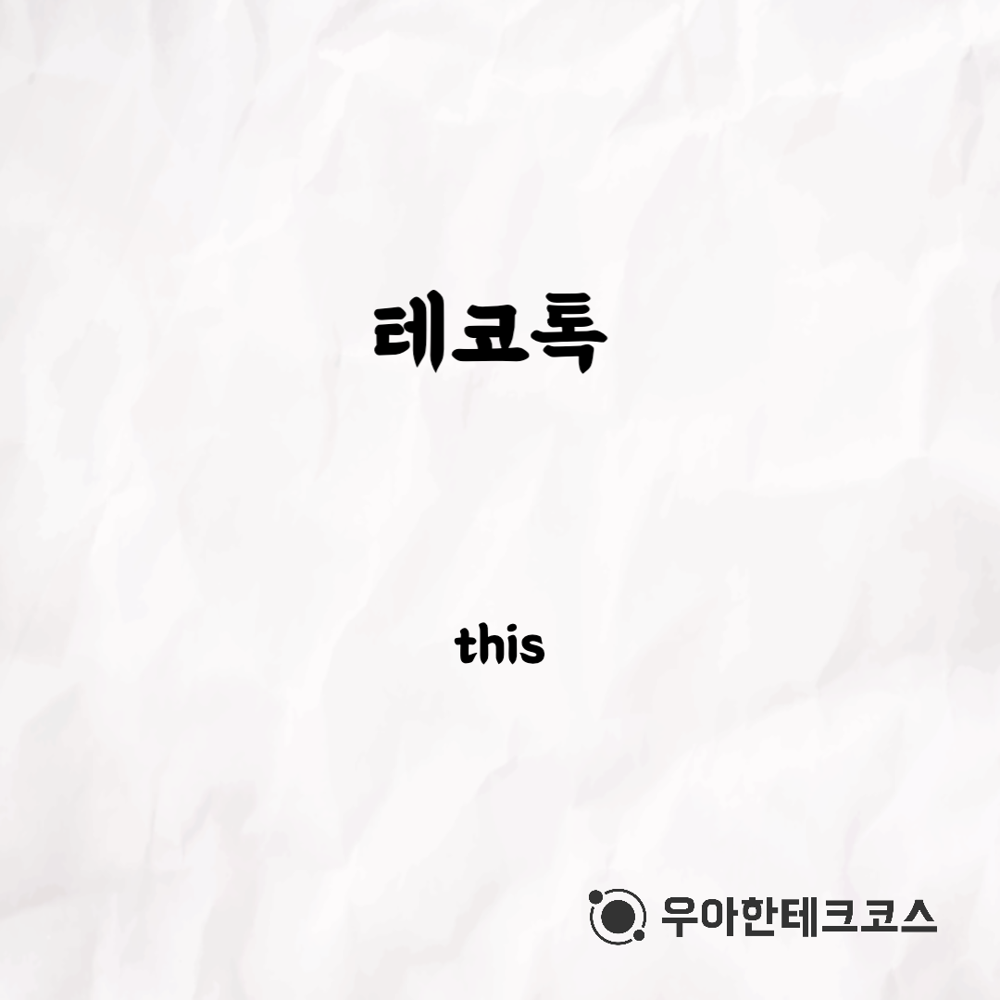
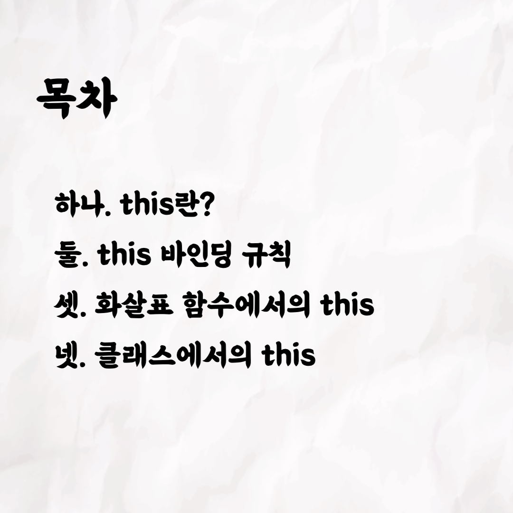
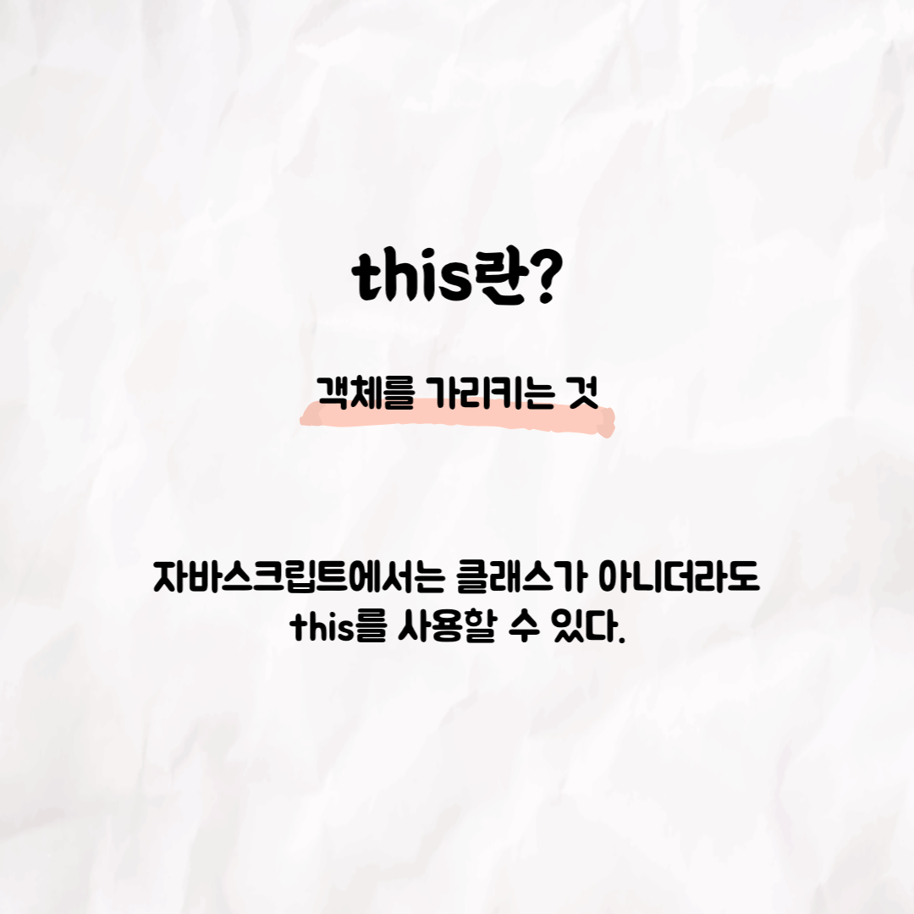
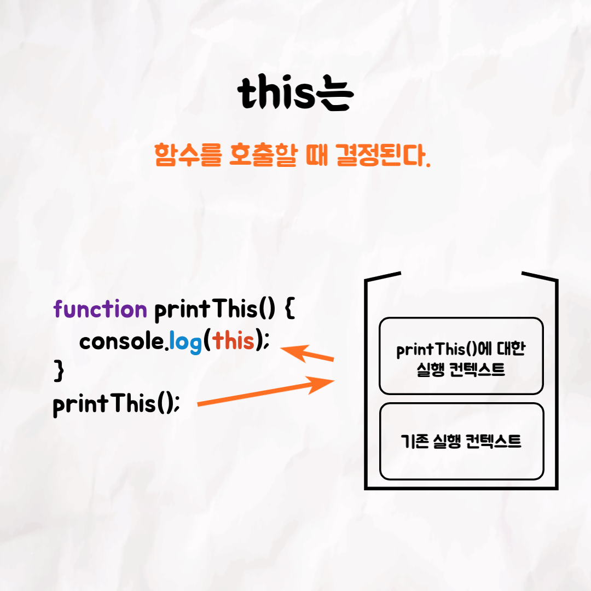
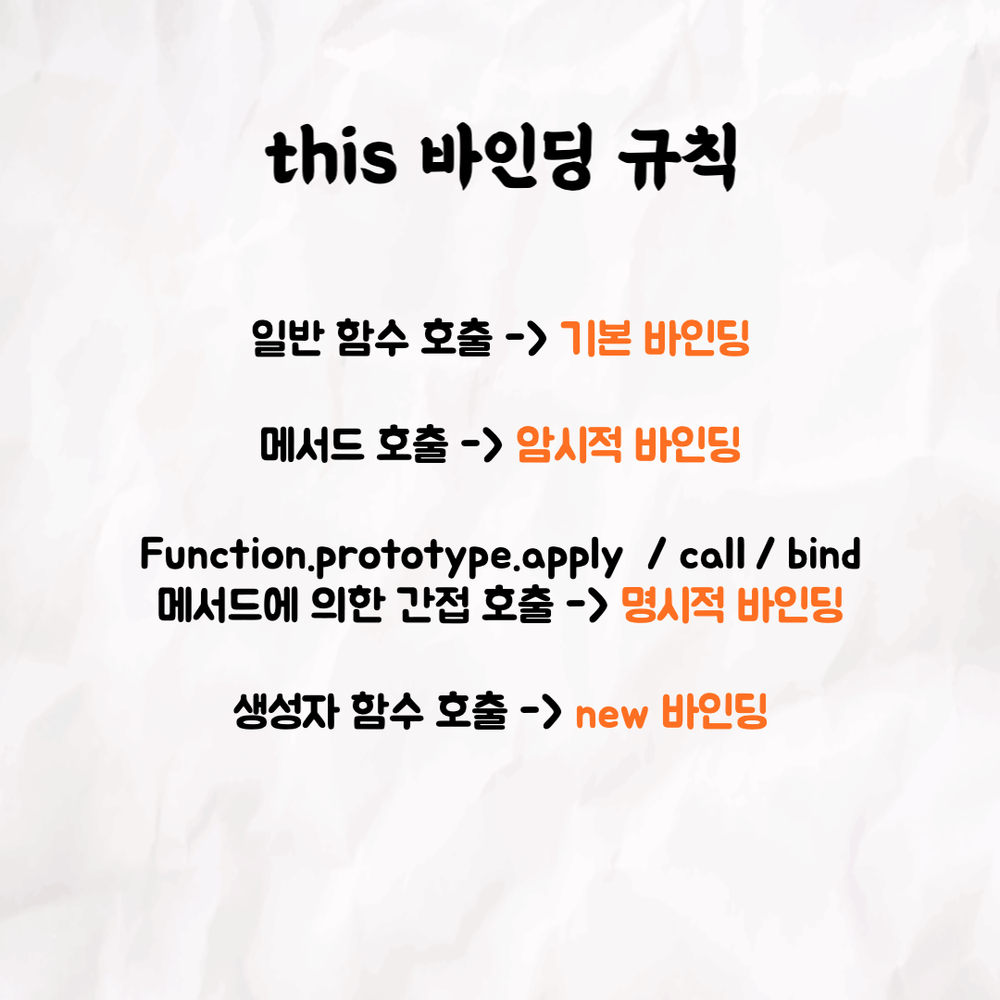
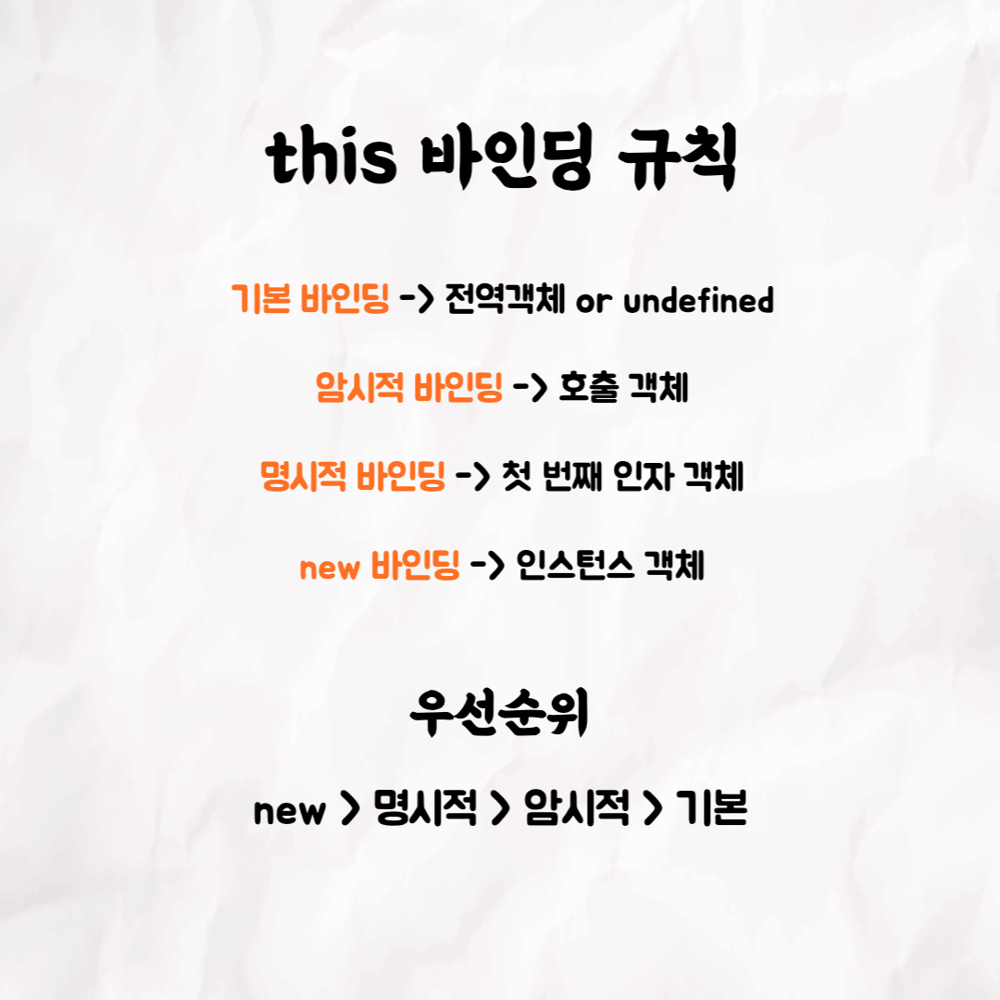
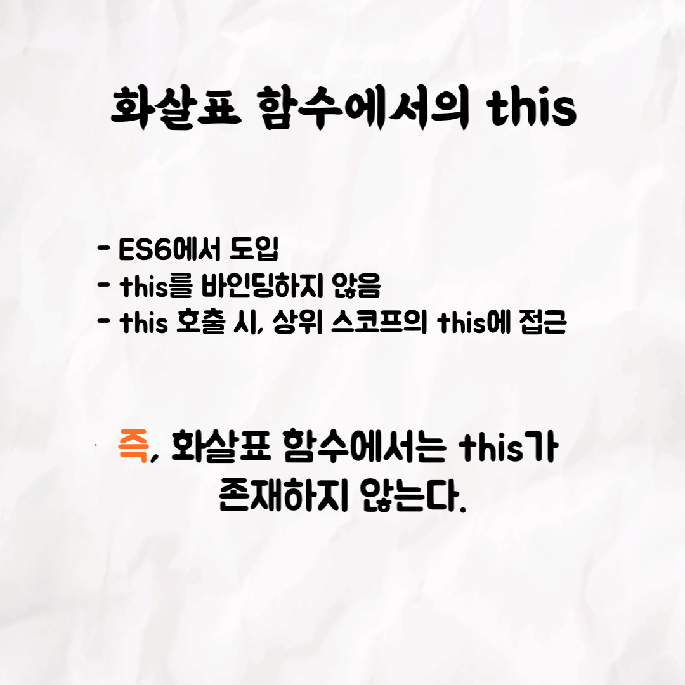
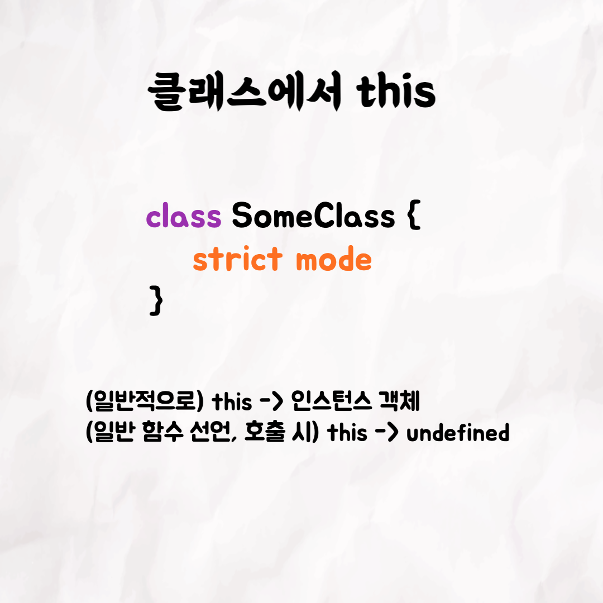

### 테코톡 - 하리의 this

001

002

003

004

005

006

007

008

009

📮 테코톡

발표자: 하리

자바스크립트에서 굉장히 중요한 부분인 this에 대해서 하리가 발표를 해주셨어요~
this에 대해서 자세히 알아보고 싶다면 유튜브에 '우아한테크코스 하리의 this'를 검색해보세요!

우아한Tech 유튜브:https://www.youtube.com/c/%EC%9A%B0%EC%95%84%ED%95%9CTech

우아한테크코스 홈페이지:https://woowacourse.github.io

우테코 블로그(Tecoble):https://tecoble.techcourse.co.kr

#우아한테크코스#우테코#테코톡#개발자#java#javascript#spring#react#개발문화#개발#개발자#woowahantechcourse#wooteco#techcourse
