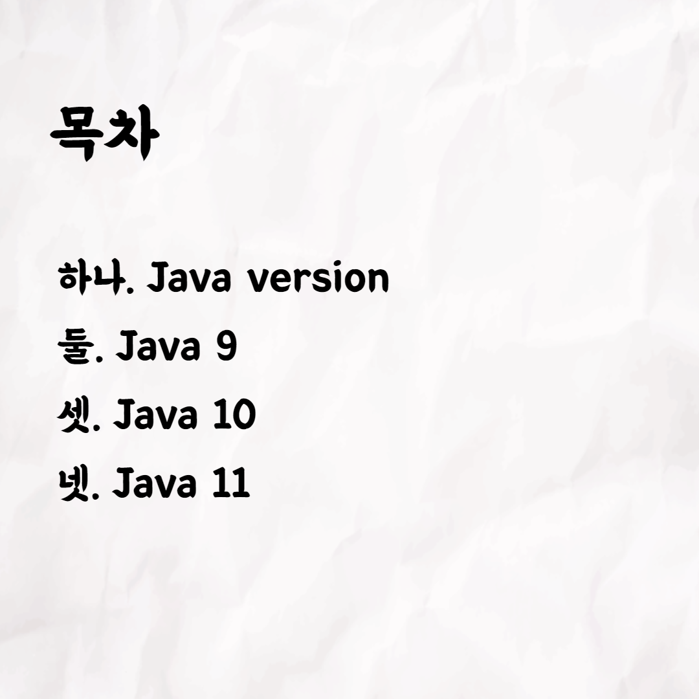
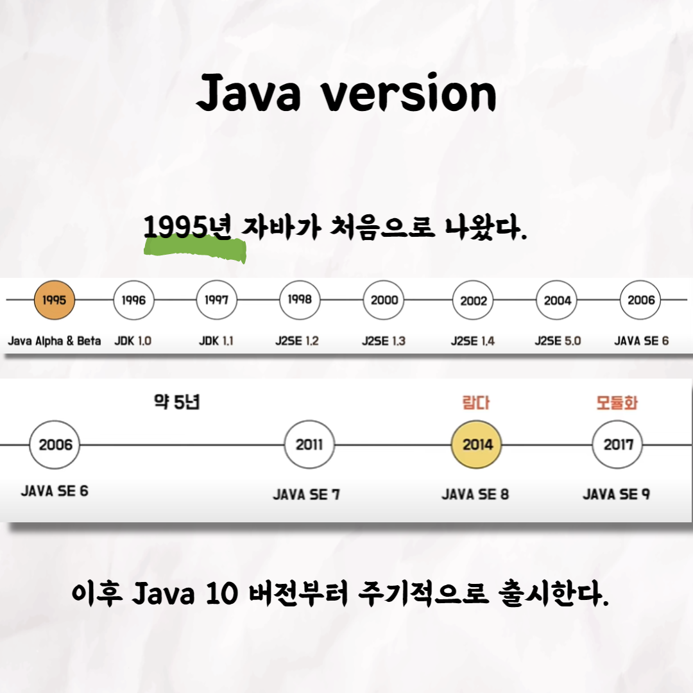
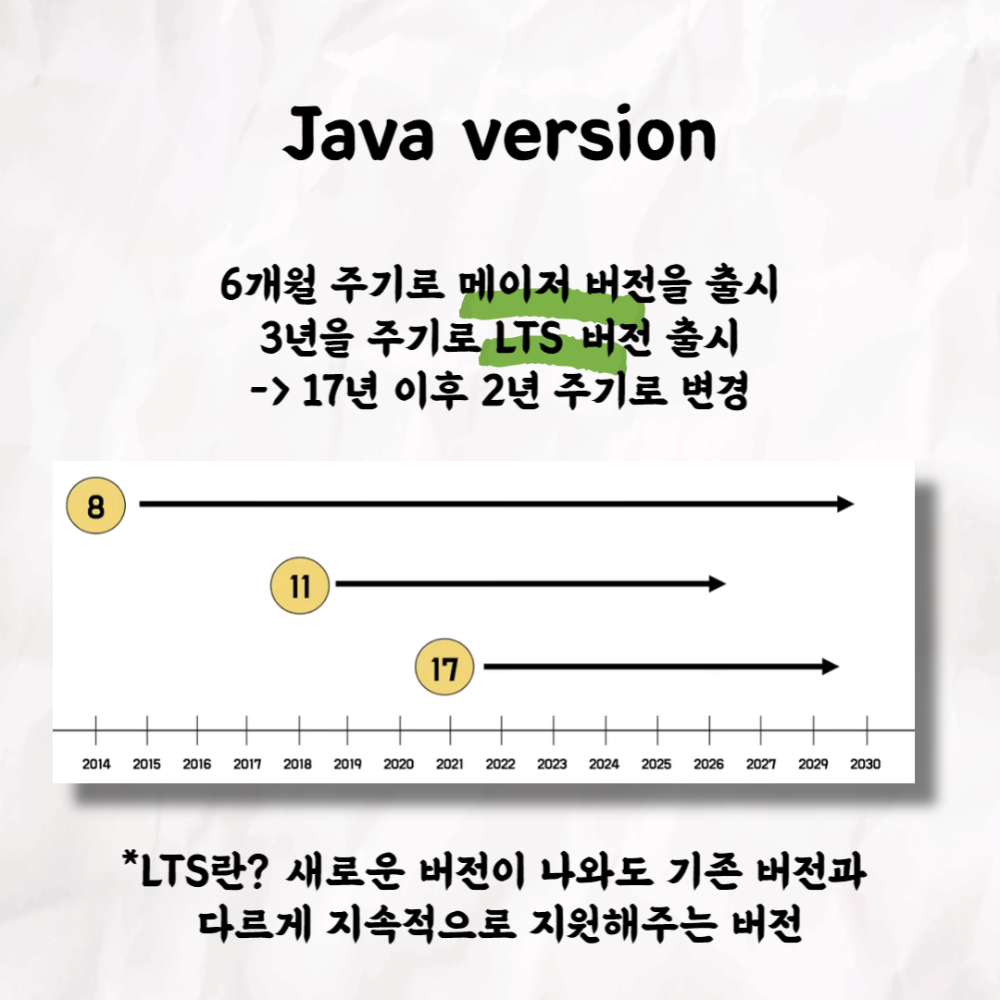
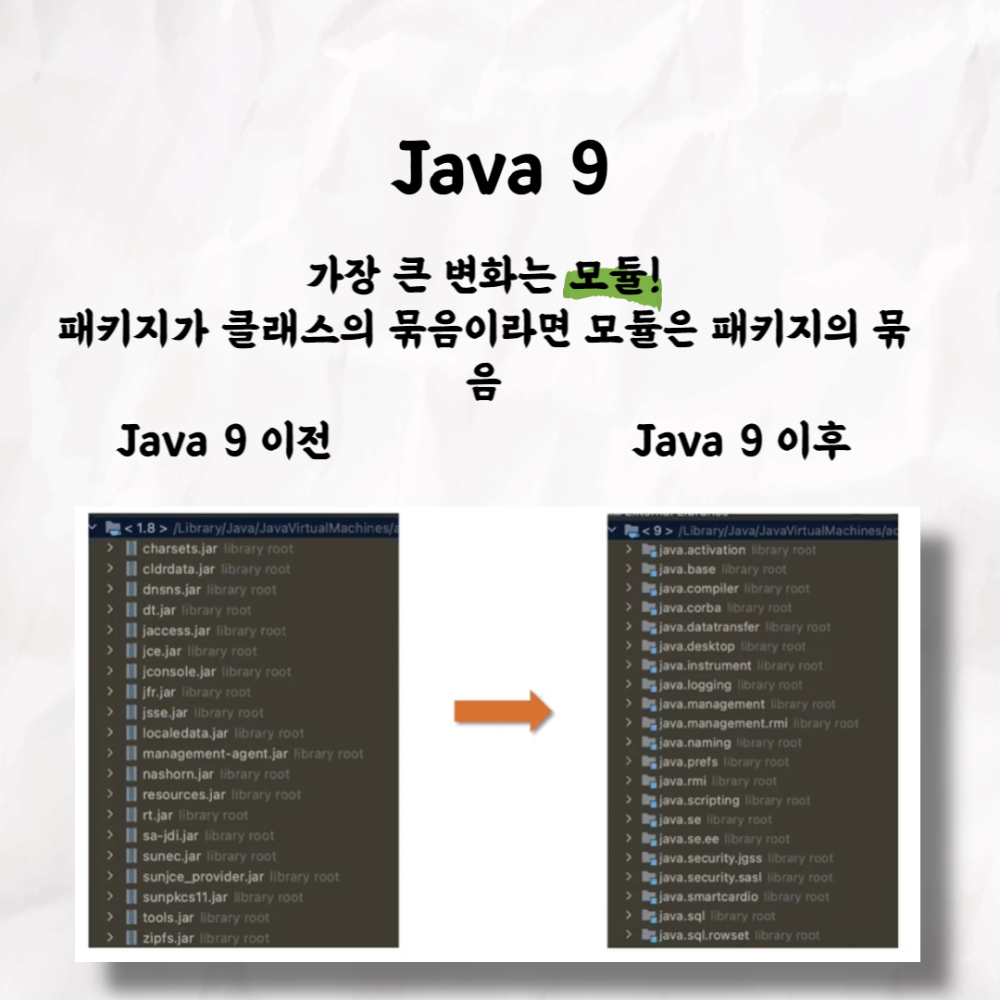
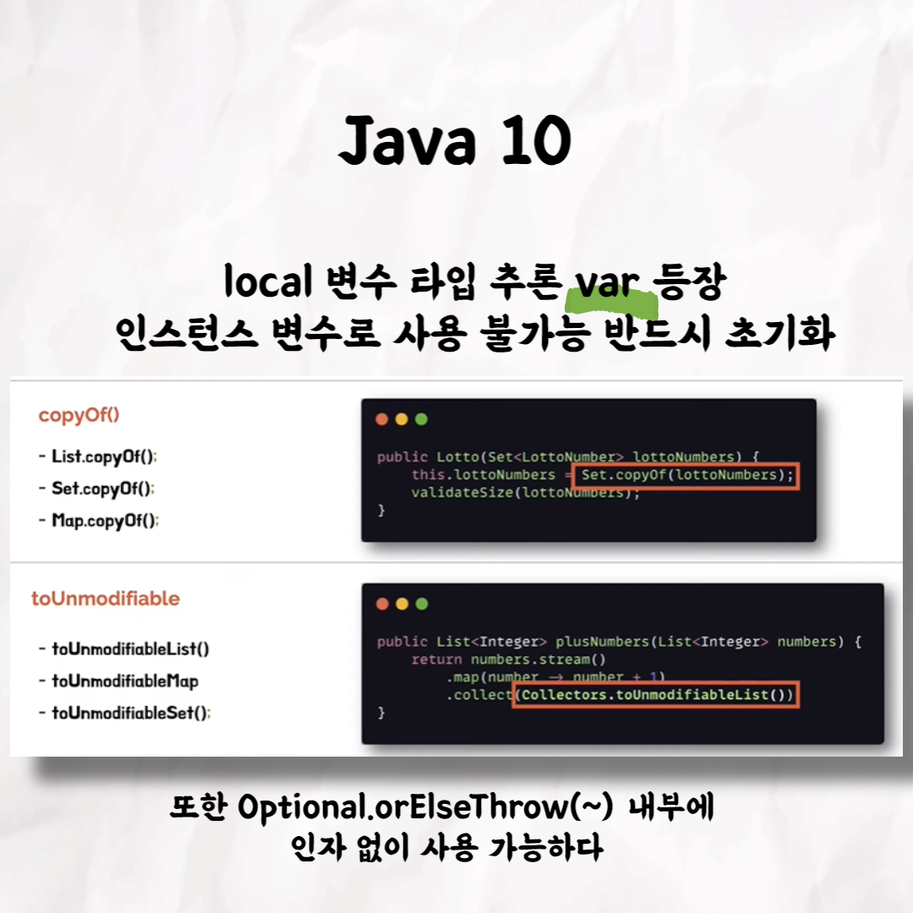
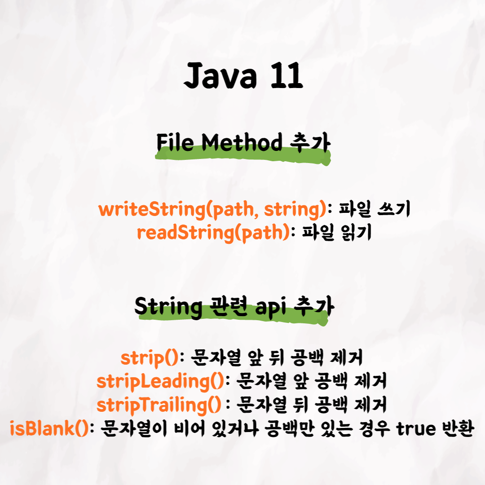
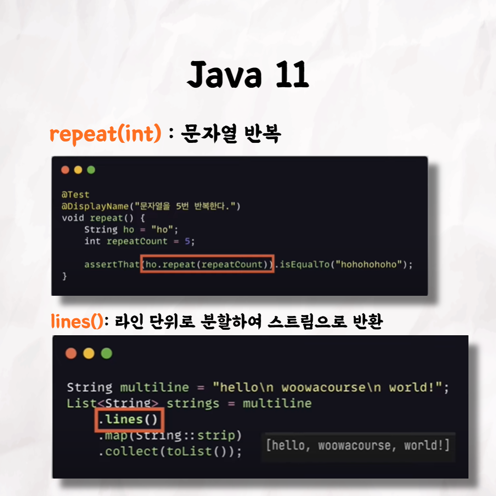

## 호호의 Java 11

### 1번

### 2번

### 3번

### 4번

### 5번

### 6번

### 7번

### 8번

### 9번

### 10번

📮 테코톡

주제 : Java 11

발표자 : 호호 🎅

우아한테크코스만의 문화인 테코톡, 이번 주인공은 호호인데요 😆  
Java의 버전과 역사가 궁금하시거나
Java 11에 대해서 궁금하시다면❓❗️ 
호호의 Java 11에 대해 들어보세요 ❗️

영상은 유튜브에 "호호의 Java 11"로 검색하시면 찾아보실 수 있습니다.

우아한Tech 유튜브 : https://www.youtube.com/c/%EC%9A%B0%EC%95%84%ED%95%9CTech

우아한테크코스 홈페이지 : https://woowacourse.github.io

우테코 블로그(Tecoble) : https://tecoble.techcourse.co.kr

#우아한테크코스 #우테코 #잠실 #선릉 #부트캠프 #java #javascript #spring #react #개발문화 #개발 #개발자 #wooteco #techcourse #테코톡 #tecotalk #eventloop
